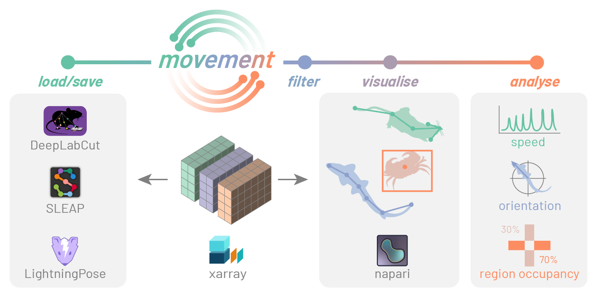

# movement

A Python toolbox for analysing body movements across space and time, to aid the study of animal behaviour in neuroscience.

> [!Note]
> Read the [documentation](https://movement.neuroinformatics.dev) for more information, including [installation instructions](https://movement.neuroinformatics.dev/getting_started.html#installation) and [examples](https://movement.neuroinformatics.dev/examples/index.html).

- [Overview](#overview)
- [Status](#status)
- [Join the movement](#join-the-movement)
- [License](#license)
- [Package template](#package-template)

## Overview

Pose estimation tools, such as [DeepLabCut](https://www.mackenziemathislab.org/deeplabcut) and [SLEAP](https://sleap.ai/) are now commonplace when processing video data of animal behaviour. There is not yet a standardised, easy-to-use way to process the pose tracks produced from these software packages.

movement aims to provide a consistent modular interface to analyse pose tracks, allowing steps such as data cleaning, visualisation and motion quantification.
We aim to support a range of pose estimation packages, along with 2D or 3D tracking of single or multiple animals.

Find out more on our [mission and scope](https://movement.neuroinformatics.dev/community/mission-scope.html) statement and our [roadmap](https://movement.neuroinformatics.dev/community/roadmap.html).

## Status
> [!Warning]
> 🏗️ The package is currently in early development and the interface is subject to change. Feel free to play around and provide feedback.

## Join the movement

Contributions to movement are absolutely encouraged, whether to fix a bug, develop a new feature, or improve the documentation.
To help you get started, we have prepared a detailed [contributing guide](https://movement.neuroinformatics.dev/community/contributing.html).

You are welcome to chat with the team on [zulip](https://neuroinformatics.zulipchat.com/#narrow/stream/406001-Movement). You can also [open an issue](https://github.com/neuroinformatics-unit/movement/issues) to report a bug or request a new feature.

## License
⚖️ [BSD 3-Clause](./LICENSE)

## Package template
This package layout and configuration (including pre-commit hooks and GitHub actions) have been copied from the [python-cookiecutter](https://github.com/neuroinformatics-unit/python-cookiecutter) template.
