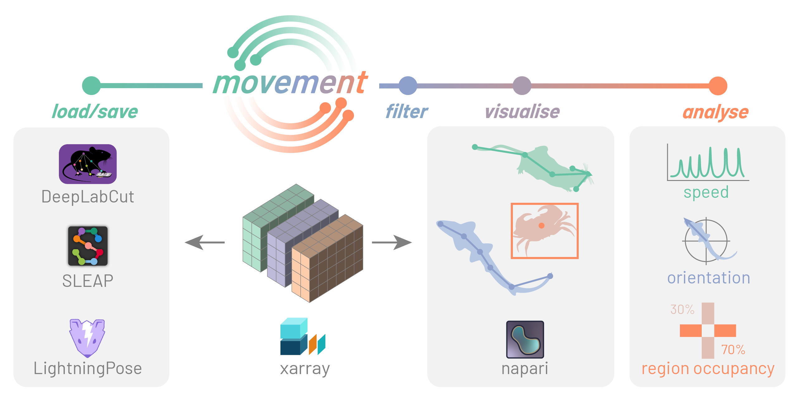

[](https://pypi.org/project/movement)
[](https://pypi.org/project/movement)
[](https://anaconda.org/conda-forge/movement)
[](https://opensource.org/licenses/BSD-3-Clause)
[](https://github.com/neuroinformatics-unit/movement/actions)
[](https://codecov.io/gh/neuroinformatics-unit/movement)
[](https://mybinder.org/v2/gh/neuroinformatics-unit/movement/gh-pages?filepath=notebooks/examples)
[](https://github.com/astral-sh/ruff)
[](https://github.com/pre-commit/pre-commit)
[](https://neuroinformatics.zulipchat.com/#narrow/stream/406001-Movement/topic/Welcome!)
[](https://zenodo.org/doi/10.5281/zenodo.12755724)

# movement

A Python toolbox for analysing animal body movements across space and time.




## Quick install

Create and activate a conda environment with movement installed (including the GUI):
```bash
conda create -n movement-env -c conda-forge movement napari pyqt
conda activate movement-env
```


> [!Note]
> Read the [documentation](https://movement.neuroinformatics.dev) for more information, including [full installation instructions](https://movement.neuroinformatics.dev/user_guide/installation.html) and [examples](https://movement.neuroinformatics.dev/examples/index.html).

## Overview

Deep learning methods for motion tracking have revolutionised a range of
scientific disciplines, from neuroscience and biomechanics, to conservation
and ethology. Tools such as
[DeepLabCut](https://www.mackenziemathislab.org/deeplabcut) and
[SLEAP](https://sleap.ai/) now allow researchers to track animal movements
in videos with remarkable accuracy, without requiring physical markers.
However, there is still a need for standardised, easy-to-use methods
to process the tracks generated by these tools.

`movement` aims to provide a consistent, modular interface for analysing
motion tracks, enabling steps such as data cleaning, visualisation,
and motion quantification. We aim to support all popular animal tracking
frameworks and file formats.

Find out more on our [mission and scope](https://movement.neuroinformatics.dev/community/mission-scope.html) statement and our [roadmap](https://movement.neuroinformatics.dev/community/roadmaps.html).

<!-- Start Admonitions -->

> [!Tip]
> If you prefer analysing your data in R, we recommend checking out the
> [animovement](https://roald-arboel.com/animovement/) toolbox, which is similar in scope.
> We are working together with its developer
> to gradually converge on common data standards and workflows.

<!-- End Admonitions -->

## Join the movement

Contributions to movement are absolutely encouraged, whether to fix a bug, develop a new feature, or improve the documentation.
To help you get started, we have prepared a detailed [contributing guide](https://movement.neuroinformatics.dev/community/contributing.html).

- [Chat with the team on Zulip](https://neuroinformatics.zulipchat.com/#narrow/stream/406001-Movement).
- [Open an issue](https://github.com/neuroinformatics-unit/movement/issues) to report a bug or request a new feature.
- [Follow this Zulip topic](https://neuroinformatics.zulipchat.com/#narrow/channel/406001-Movement/topic/Community.20Calls) to receive updates about upcoming Community Calls.

## Citation

If you use movement in your work, please cite the following Zenodo DOI:

> Nikoloz Sirmpilatze, Chang Huan Lo, Sofía Miñano, Brandon D. Peri, Dhruv Sharma, Laura Porta, Iván Varela & Adam L. Tyson (2024). neuroinformatics-unit/movement. Zenodo. https://zenodo.org/doi/10.5281/zenodo.12755724

## License
⚖️ [BSD 3-Clause](./LICENSE)

## Package template
This package layout and configuration (including pre-commit hooks and GitHub actions) have been copied from the [python-cookiecutter](https://github.com/neuroinformatics-unit/python-cookiecutter) template.
