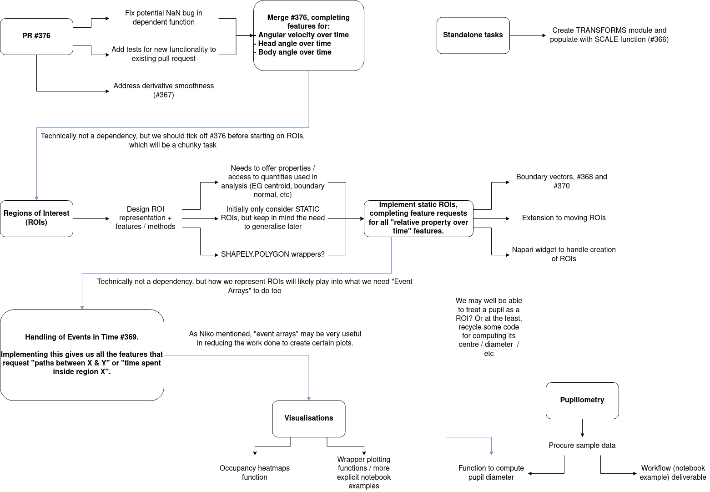

# Spatial Navigation Feature Update

_This is a short summary of the spatial navigation features introduced during Jan-Feb 2025._

This work was part of a collaboration involving Sepiedeh Keshavarzi (Cambridge University), the Centre for Advanced Research Computing at University College London(UCL-ARC), and the core `movement` development team and has been funded by the Wellcome Trust.

_At a glance_

- **Regions of Interest (RoIs)**: An RoI backend was added for analysis of RoIs, allowing future development of the napari plugin.
- **Plot Wrapper Functions**: Added to aid in initial "eyeballing" of data, making it easy to create common analysis plots with a single line of code.
- **New examples**: {ref}`Extend your analysis methods along data dimensions <sphx_glr_examples_broadcasting_your_own_methods.py>`, {ref}`Pupil tracking <sphx_glr_examples_mouse_eye_movements.py>`.

## Original Roadmap

Between January and February 2025, the `movement` developer team decided to focus on expanding the suite of tools useful for the analysis of spatial navigation.
This work started with the creation of so-called "backend" functions that can perform general operations on vectors in an efficient manner, from which friendlier functions could be provided.
Once these features were in place, development would start on supporting "Regions of Interest" (RoIs) within `movement`.
RoIs are essentially labelled regions in space that have some significance in the experimental setup - the location of a nest, or the extent of the enclosure, for example.
By providing a way to store and describe these objects within `movement`, analysis workflows can be simplified and can make use of the existing "backend" functions to provide convenient access to interesting quantities; such as the distance of each individual from a RoI, or the relative orientation of an individual from the nearest wall of the enclosure.

There were also a few independent bursts of development in other areas; including providing sample pupillometry data and an example workflow showing how `movement` can be used to explore different aspects of the data (e.g. position, velocity, and diameter of the pupil), and how to normalise and filter the data.

A copy of the original roadmap that was [shared on Zulip](movement-zulip:topic/Roadmap.3A.20Spatial.20Navigation/near/495022291) is provided below.

## What's Been Introduced?

In addition to the topics listed below, we have also introduced the following smaller, self-contained features to `movement`:

- We have new sample datasets available, including two eye-movement tracking (pupillometry) datasets. An example of how to analyse this data using `movement` was introduced in [#429](movement-github:pull/429) and can be found {ref}`here <sphx_glr_examples_mouse_eye_movements.py>`.
- It is now possible to scale `DataArray`s expressed in pixels into other units via the {func}`movement.transforms.scale` function. Introduced in [#384](movement-github:pull/384).

Additionally, we have begun planning our approach to supporting annotations in time, via what we are calling [condition arrays](movement-github:issues/418).
[RoIs](#regions-of-interest-rois) provide us with a way to annotate regions in space, and the natural next step is to provide a way of supporting annotations in time too.
Time annotations might correspond to certain stimuli in an experiment - the introduction of a reward or a change in the environment for example - and being able to refer to the corresponding time-points in an analysis by the names of these events would be very useful.
Being able to have these events interact seamlessly with RoIs is also highly desirable.
At present, we have started on [one such feature](movement-github:pull/421), for determining the time-points at which (multiple) RoIs were occupied.
It is early days currently, but you can join in the conversation for what's planned [over on GitHub](movement-github:issues/418).

### Plotting Made Easier

The `movement.plots` submodule has been created, which provides some helpful wrapper functions for producing some of the more common plot types that come out of the analysis of `movement` datasets.
These plots can be added to existing figure axes you have created, and you can pass them the same formatting arguments as you would to the appropriate `matplotlib.pyplot`.
Currently, the submodule has two wrappers to use:

- `plot_centroid_trajectory`, which creates a plot of the trajectory of a given keypoint (or the centroid of a collection of keypoints) with a single line of code. Introduced in [#394](movement-github:pull/394).
- `plot_occupancy`, which creates an occupancy plot of an individual, given its position data. Collections of individuals are aggregated over, and if multiple keypoints are provided, the occupancy of the centroid is calculated. Introduced in [#403](movement-github:pull/403).

Examples to showcase the use of these plotting functions are currently [being produced](movement-github:issues/415).
[Our other examples](https://movement.neuroinformatics.dev/examples/index.html) have also been updated to use these functions where possible.

### Broadcasting Methods

Most of the time during analysis of experimental data, we want to repeat the same action multiple times across different coordinates, or individuals, or time-points.
The data-structures that `movement` relies on - and the analysis methods it provides - go a long way to making this kind of analysis easy, thanks to array broadcasting.
However when it comes to writing your own, custom analysis functions, most of the time it is much easier to write a function that takes in a single input, rather than writing an appropriate function that acts on an entire `DataArray`.
But this approach typically means that you're then stuck writing a `for` loop over the values in your `DataArray`, and on top of that having to copy across the dimension labels or coordinates into the new array you're making as the `for` loop runs.

With this in mind, we have decided to expose the {func}`movement.utils.broadcasting.make_broadcastable` decorator, which can turn functions that take in one-dimensional data (e.g., a single spatial coordinate, or a single time-point) into functions that act across `DataArray`s with appropriate dimensions.
You can find a new {ref}`example <sphx_glr_examples_broadcasting_your_own_methods.py>` on how to use this decorator on your own functions.

### Regions of Interest (RoIs)

One of the biggest feature introductions to `movement` during this period is support for RoIs.
We now support one-dimensional regions of interest (segments, or piecewise-linear structures formed of multiple segments) as well as two-dimensional polygonal regions.
You can create RoIs using the {class}`LineOfInterest <movement.roi.line.LineOfInterest>` and {class}`PolygonOfInterest <movement.roi.polygon.PolygonOfInterest>` classes respectively.
There are more details about how the class is implemented on top of [`shapely`](https://shapely.readthedocs.io/en/stable/) in the {class}`docstring <movement.roi.base.BaseRegionOfInterest>`, and a note about how the interior of 2D shapes is handled.

RoIs support the calculation of certain quantities from experimental data.
Highlights include:

- Determining if a given point(s) is inside the RoI, {func}`contains_point <movement.roi.base.BaseRegionOfInterest.contains_point>`.
- Determining the distance from a given point(s) to the closest point on the RoI, {func}`compute_distance_to <movement.roi.base.BaseRegionOfInterest.compute_distance_to>`.
- Determining the approach vector from a given point(s) to the RoI, {func}`compute_approach_vector <movement.roi.base.BaseRegionOfInterest.compute_approach_vector>`.
- Determining egocentric and allocentric boundary angles, relative to a given RoI. See {func}`compute_allocentric_angle_to_nearest_point <movement.roi.base.BaseRegionOfInterest.compute_allocentric_angle_to_nearest_point>` and {func}`compute_egocentric_angle_to_nearest_point <movement.roi.base.BaseRegionOfInterest.compute_egocentric_angle_to_nearest_point>` for more information.

### What's next?

We have [an example underway](movement-github:issues/415) that will demonstrate how to load in a dataset, define a region of interest, and query the loaded trajectories for the time periods when they were inside or outside the defined region.
We also have [another example in the works](movement-github:pull/440) that will go through the boundary-angle methods.

Looking forward, [we will be aiming to](movement-github:issues/378) extend the `napari` plugin's [capabilities](../user_guide/gui.md) to allow users to define RoIs graphically, from within the `napari` GUI, by clicking points to define regions.
