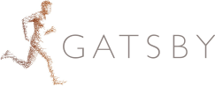

(target-people)=
# People

## Leadership
`movement` is led by the [Neuroinformatics Unit](https://neuroinformatics.dev/) at the
[Sainsbury Wellcome Centre](https://www.sainsburywellcome.org/web/) by [Niko Sirmpilatze](https://github.com/niksirbi) and
[Adam Tyson](https://github.com/adamltyson).
The current active core development team is composed of:
- [Adam Tyson](https://github.com/adamltyson)
- [Niko Sirmpilatze](https://github.com/niksirbi)
- [Chang Huan Lo](https://github.com/lochhh)
- [Sofía Miñano](https://github.com/sfmig)

## Contributors
:::contributors-table
<!-- readme: contributors,Sepidak,sannatitus,lkatsouri,athenaakrami,dimokaramanlis,shailajaAkella,mehulrastogi,NeuroDuan,roaldarbol -start -->
<!-- readme: contributors,Sepidak,sannatitus,lkatsouri,athenaakrami,dimokaramanlis,shailajaAkella,mehulrastogi,NeuroDuan,roaldarbol -end -->
:::

## Funders
`movement` is made possible thanks to grant funding and the generous support of our host institutions:

    
    
    
    

