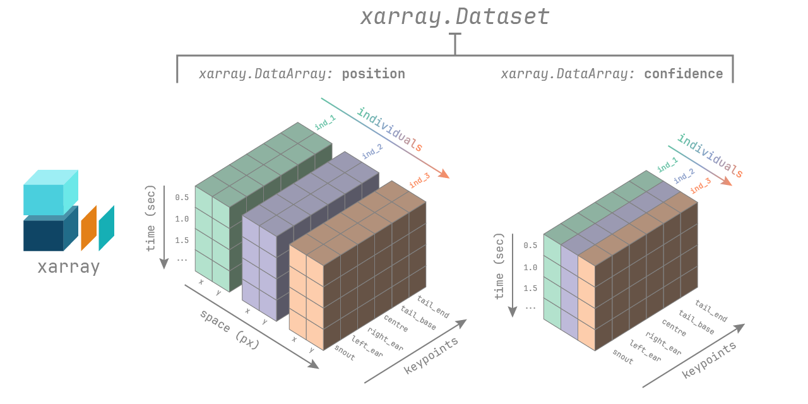

# Getting Started

## Installation

:::{admonition} Use a conda environment
:class: note
We recommend you install movement inside a [conda](conda:)
or [mamba](mamba:) environment, to avoid dependency conflicts with other packages.
In the following we assume you have `conda` installed,
but the same commands will also work with `mamba`/`micromamba`.
:::

First, create and activate an environment with some prerequisites.
You can call your environment whatever you like, we've used "movement-env".

```sh
conda create -n movement-env -c conda-forge python=3.10 pytables
conda activate movement-env
```

Then install the `movement` package as described below.

::::{tab-set}

:::{tab-item} Users
To get the latest release from PyPI:

```sh
pip install movement
```
If you have an older version of `movement` installed in the same environment,
you can update to the latest version with:

```sh
pip install --upgrade movement
```
:::

:::{tab-item} Developers
To get the latest development version, clone the
[GitHub repository](movement-github:)
and then run from inside the repository:

```sh
pip install -e .[dev]  # works on most shells
pip install -e '.[dev]'  # works on zsh (the default shell on macOS)
```

This will install the package in editable mode, including all `dev` dependencies.
Please see the [contributing guide](target-contributing) for more information.
:::

::::


## Loading data
You can load predicted pose tracks from the pose estimation software packages
[DeepLabCut](dlc:), [SLEAP](sleap:), or [LightingPose](lp:).

First import the `movement.io.load_poses` module:

```python
from movement.io import load_poses
```

Then, depending on the source of your data, use one of the following functions:

::::{tab-set}

:::{tab-item} SLEAP

Load from [SLEAP analysis files](sleap:tutorials/analysis) (.h5):
```python
ds = load_poses.from_sleap_file("/path/to/file.analysis.h5", fps=30)

# or equivalently
ds = load_poses.from_file(
    "/path/to/file.analysis.h5", source_software="SLEAP", fps=30
)
```
:::

:::{tab-item} DeepLabCut

Load pose estimation outputs from .h5 files:
```python
ds = load_poses.from_dlc_file("/path/to/file.h5", fps=30)
```

You may also load .csv files (assuming they are formatted as DeepLabCut expects them):
```python
ds = load_poses.from_dlc_file("/path/to/file.csv", fps=30)

# or equivalently
ds = load_poses.from_file(
    "/path/to/file.csv", source_software="DeepLabCut", fps=30
)
```

If you have already imported the data into a pandas DataFrame, you can
convert it to a movement dataset with:
```python
import pandas as pd

df = pd.read_hdf("/path/to/file.h5")
ds = load_poses.from_dlc_df(df, fps=30)
```
:::

:::{tab-item} LightningPose

Load from LightningPose (LP) files (.csv):
```python
ds = load_poses.from_lp_file("/path/to/file.analysis.csv", fps=30)

# or equivalently
ds = load_poses.from_file(
    "/path/to/file.analysis.csv", source_software="LightningPose", fps=30
)
```
:::

::::

You can also try movement out on some sample data included in the package.

:::{dropdown} Fetching sample data
:color: primary
:icon: unlock

You can view the available sample data files with:

```python
from movement import sample_data

file_names = sample_data.list_sample_data()
print(file_names)
```

This will print a list of file names containing sample pose data.
Each file is prefixed with the name of the pose estimation software package
that was used to generate it - either "DLC", "SLEAP", or "LP".

To get the path to one of the sample files,
you can use the `fetch_pose_data_path` function:

```python
file_path = sample_data.fetch_sample_data_path("DLC_two-mice.predictions.csv")
```
The first time you call this function, it will download the corresponding file
to your local machine and save it in the `~/.movement/data` directory. On
subsequent calls, it will simply return the path to that local file.

You can feed the path to the `from_dlc_file`, `from_sleap_file`, or
`from_lp_file` functions and load the data, as shown above.

Alternatively, you can skip the `fetch_sample_data_path()` step and load the
data directly using the `fetch_sample_data()` function:

```python
ds = sample_data.fetch_sample_data("DLC_two-mice.predictions.csv")
```

:::

## Working with movement datasets

Loaded pose estimation data are represented in movement as
[`xarray.Dataset`](xarray:generated/xarray.Dataset.html) objects.

You can view information about the loaded dataset by printing it:
```python
ds = load_poses.from_dlc_file("/path/to/file.h5", fps=30)
print(ds)
```
If you are working in a Jupyter notebook, you can also view an interactive
representation of the dataset by simply typing its name - e.g. `ds` - in a cell.

### Dataset structure



The movement `xarray.Dataset` has the following dimensions:
- `time`: the number of frames in the video
- `individuals`: the number of individuals in the video
- `keypoints`: the number of keypoints in the skeleton
- `space`: the number of spatial dimensions, either 2 or 3

Appropriate coordinate labels are assigned to each dimension:
list of unique names (str) for `individuals` and `keypoints`,
['x','y',('z')] for `space`. The coordinates of the `time` dimension are
in seconds if `fps` is provided, otherwise they are in frame numbers.

The dataset contains two data variables stored as
[`xarray.DataArray`](xarray:generated/xarray.DataArray.html#xarray.DataArray) objects:
- `pose_tracks`: with shape (`time`, `individuals`, `keypoints`, `space`)
- `confidence`: with shape (`time`, `individuals`, `keypoints`)

You can think of a `DataArray` as a `numpy.ndarray` with `pandas`-style
indexing and labelling. To learn more about `xarray` data structures, see the
relevant [documentation](xarray:user-guide/data-structures.html).

The dataset may also contain the following attributes as metadata:
- `fps`: the number of frames per second in the video
- `time_unit`: the unit of the `time` coordinates, frames or seconds
- `source_software`: the software from which the pose tracks were loaded
- `source_file`: the file from which the pose tracks were loaded

### Indexing and selection
You can access the data variables and attributes of the dataset as follows:
```python
pose_tracks = ds.pose_tracks  # ds["pose_tracks"] also works
confidence = ds.confidence

fps = ds.fps   # ds.attrs["fps"] also works
```

You can select subsets of the data using the `sel` method:
```python
# select the first 100 seconds of data
ds_sel = ds.sel(time=slice(0, 100))

# select specific individuals or keypoints
ds_sel = ds.sel(individuals=["individual1", "individual2"])
ds_sel = ds.sel(keypoints="snout")

# combine selections
ds_sel = ds.sel(time=slice(0, 100), individuals=["individual1", "individual2"], keypoints="snout")
```
All of the above selections can also be applied to the data variables,
resulting in a `DataArray` rather than a `Dataset`:

```python
pose_tracks = ds.pose_tracks.sel(individuals="individual1", keypoints="snout")
```
You may also use all the other powerful [indexing and selection](xarray:user-guide/indexing.html) methods provided by `xarray`.

### Plotting

You can also use the built-in [`xarray` plotting methods](xarray:user-guide/plotting.html)
to visualise the data. Check out the [Load and explore pose tracks](./examples/load_and_explore_poses.rst)
example for inspiration.

## Saving data
You can save movement datasets to disk in a variety of formats, including
DeepLabCut-style files (.h5 or .csv) and [SLEAP-style analysis files](sleap:tutorials/analysis) (.h5).

First import the `movement.io.save_poses` module:

```python
from movement.io import save_poses
```

Then, depending on the desired format, use one of the following functions:

:::::{tab-set}

::::{tab-item} SLEAP

Save to SLEAP-style analysis files (.h5):
```python
save_poses.to_sleap_analysis_file(ds, "/path/to/file.h5")
```

:::{note}
When saving to SLEAP-style files, only `track_names`, `node_names`, `tracks`, `track_occupancy`,
and `point_scores` are saved. `labels_path` will only be saved if the source
file of the dataset is a SLEAP .slp file. Otherwise, it will be an empty string.
Other attributes and data variables
(i.e., `instance_scores`, `tracking_scores`, `edge_names`, `edge_inds`, `video_path`,
`video_ind`, and `provenance`) are not currently supported. To learn more about what
each attribute and data variable represents, see the
[SLEAP documentation](sleap:api/sleap.info.write_tracking_h5.html#module-sleap.info.write_tracking_h5).
:::
::::

::::{tab-item} DeepLabCut

Save to DeepLabCut-style files (.h5 or .csv):
```python
save_poses.to_dlc_file(ds, "/path/to/file.h5")  # preferred format
save_poses.to_dlc_file(ds, "/path/to/file.csv")
```

Alternatively, you can first convert the dataset to a
DeepLabCut-style `pandas.DataFrame` using the `to_dlc_df` function:
```python
df = save_poses.to_dlc_df(ds)
```
and then save it to file using any `pandas` method, e.g. `to_hdf` or `to_csv`.
::::

::::{tab-item} LightningPose

Save to LightningPose (LP) files (.csv).
```python
save_poses.to_lp_file(ds, "/path/to/file.csv")
```
:::{note}
Because LP saves pose estimation outputs in the same format as single-animal
DeepLabCut projects, the above command is equivalent to:
```python
save_poses.to_dlc_file(ds, "/path/to/file.csv", split_individuals=True)
```
:::

::::
:::::
