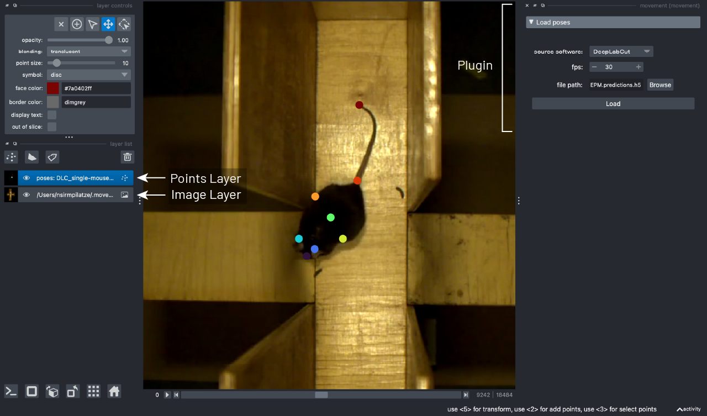

(target-gui)=
# Graphical User Interface

The `movement` graphical user interface (GUI), powered by our custom plugin for
[napari](napari:), makes it easy to view and explore `movement`
motion tracks. Currently, you can use it to
visualise 2D [movement datasets](target-poses-and-bboxes-dataset)
as points overlaid on video frames.

:::{warning}
The GUI is still in early stages of development but we are working on ironing
out the [kinks](movement-github:issues?q=sort%3Aupdated-desc+is%3Aissue+state%3Aopen+label%3AGUI+label%3Abug).
Please [get in touch](target-get-in-touch)
if you find any bugs or have suggestions for improvements!
:::

The `napari` plugin is shipped with the `movement` package starting from
version `0.1.0`.  To use it, you need to
[install the package](target-installation) via a method that
includes the `napari` dependency.


## Launch the GUI

To launch the `movement` GUI, type the following command in your terminal:

```sh
movement launch
```

This is equivalent to running `napari -w movement` and will open the `napari`
window with the `movement` widget docked on the
right-hand side, as in the [screenshot](target-widget-screenshot) below.

In `napari`, data is typically loaded into [layers](napari:guides/layers.html),
which can be reordered and toggled for visibility in the layers list panel.
For example, keypoint data can be added as a
[points layer](napari:howtos/layers/points.html),
while image stacks (including videos) can be added as
[image layers](napari:howtos/layers/image.html).
Below, we'll explain how to do this.

## Load a background layer

Though this is not strictly necessary, it is usually informative to
view the keypoints overlaid on a background that provides
some spatial context. You can either [load the video](target-load-video)
corresponding to the dataset, or a [single image](target-load-frame),
e.g., a still frame derived from that video.
You can do this by dragging and dropping the corresponding file onto the
`napari` window or by using the `File > Open File(s)` menu option.
Please read the following sections for detailed information
and some important considerations.

(target-load-video)=
### Load a video

When trying to load a video file into `napari`, you will be prompted
via a pop-up dialog to select the reader.
Choose the `video` reader—corresponding to the
[`napari-video`](https://github.com/janclemenslab/napari-video)
plugin—and click `OK`. You can optionally select to remember this reader
for all files with the same extension.

`napari-video` will load the video as an image stack with a slider
at the bottom that you can use to navigate through frames.
You may also use the left and right arrow keys to navigate
frame-by-frame.

Clicking on the play button will start the video playback at a default
rate of 10 frames per second. You can adjust that by right-clicking on the
play button or by opening the `napari > Preferences` menu
(`File > Preferences` on Windows) and changing
the `Playback frames per second` setting.

(target-video-playback-limitations)=
:::{admonition} Video playback limitations
:class: warning

- The video playback may freeze or stutter if you click on the slider to jump
  to a specific frame. We recommended pausing the playback before such jumps.
- `napari-video` may struggle to play videos at a high frame rate, depending
  on your hardware, the video resolution and codec. If you experience
  performance issues, such as the video freezing or skipping frames,
  try reducing the playback frames per second or fall back to
  using a [single image](target-load-frame) as a background.
:::


(target-load-frame)=
### Load an image

This usually means using a still frame extracted from the video, but in theory
you could use any image that's in the same coordinate system as the
tracking data. For example, you could use a schematic diagram of the arena,
as long as it has the same width and height as the video and is
properly aligned with the tracking data.

::: {dropdown} Extracting a still frame from a video
:color: info
:icon: info

You can use the command line tool [`ffmpeg`](https://www.ffmpeg.org/)
to extract a still frame from a video.

To extract the first frame of a video:

```sh
ffmpeg -i video.mp4 -frames:v 1 first-frame.png
```

To extract a frame at a specific time stamp (e.g. at 2 seconds):

```sh
ffmpeg -i video.mp4 -ss 00:00:02 -frames:v 1 frame-2sec.png
```
:::

Dragging and dropping the image file onto the `napari` window
(or opening it via the `File` menu) will load the image
as a single 2D frame without a slider.

## Load the tracked dataset

Now you are ready to load some motion tracks over your chosen background layer.

On the right-hand side of the window you should see
an expanded `Load tracked data` menu. To load tracked data in napari:
1. Select the `source software` from the dropdown menu.
2. Set the `fps`  (frames per second) of the video the data refers to. Note this will only affect the units of the time variable shown when hovering over a keypoint. If the `fps` is not known, you can set it to 1, which will effectively make the time variable equal to the frame number.
3. Select the file containing the tracked data. The path can be directly pasted or you can use the file browser button.
4. Click `Load`.

The data should be loaded into the viewer as a
[points layer](napari:howtos/layers/points.html).
By default, it is added at the top of the layer list.

::: {note}
See [supported formats](target-supported-formats) for more information on
the expected software and file formats.
:::


You will see a view similar to the one below:

(target-widget-screenshot)=



The keypoints are represented as points, colour-coded by
keypoint for single-individual datasets, or by individual for
multi-individual datasets. In datasets with one or no keypoints per individual,
the points are always colour-coded by individual. If we enable the `display_text` option in the
layer controls panel, the keypoint name will be displayed on the lower right corner of each point. If the
dataset has no keypoint dimension, the individual name is shown instead.

Hovering with your mouse over a point
(with the points layer selected) will
bring up a tooltip containing the names of the individual and keypoint,
the point-wise confidence score (provided by the source software),
and the time in seconds (calculated based on the frame number and
the `fps` value you provided).

Using the slider at the bottom of the window, you can move through
the frames of the dataset, and the points and video will update
in sync.

::: {admonition} Stay tuned
Though the display style of the points layer is currently fixed, we are
working on adding more customisation options in future releases, such as
enabling you to change the point size, colour, or shape.
:::
