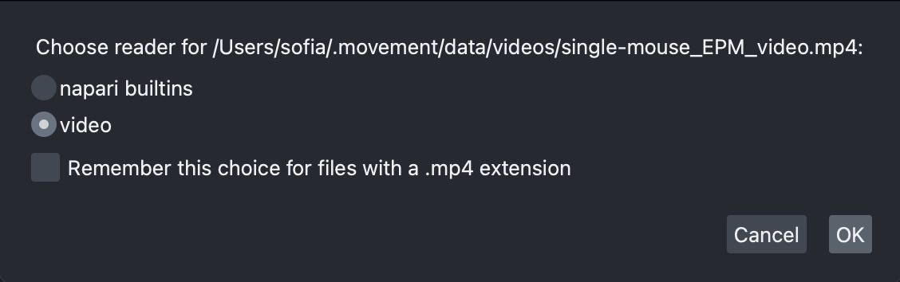
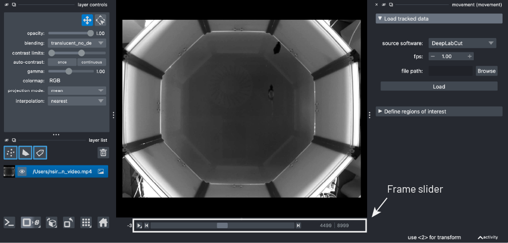
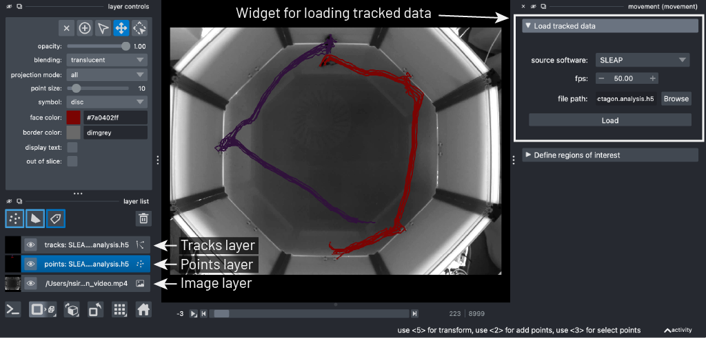
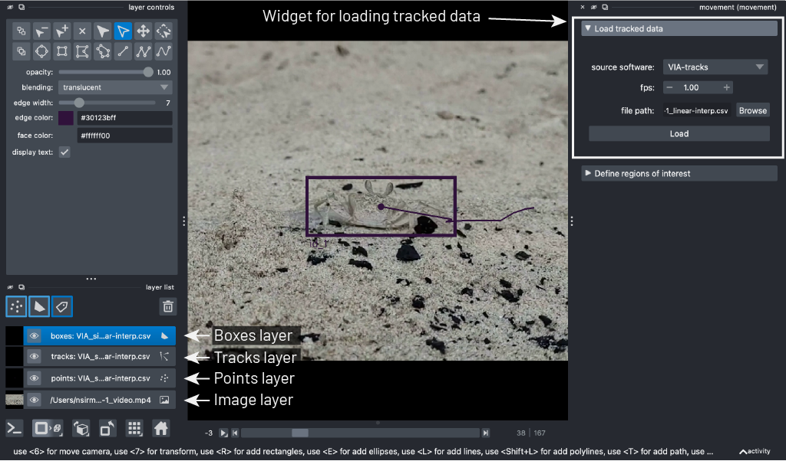
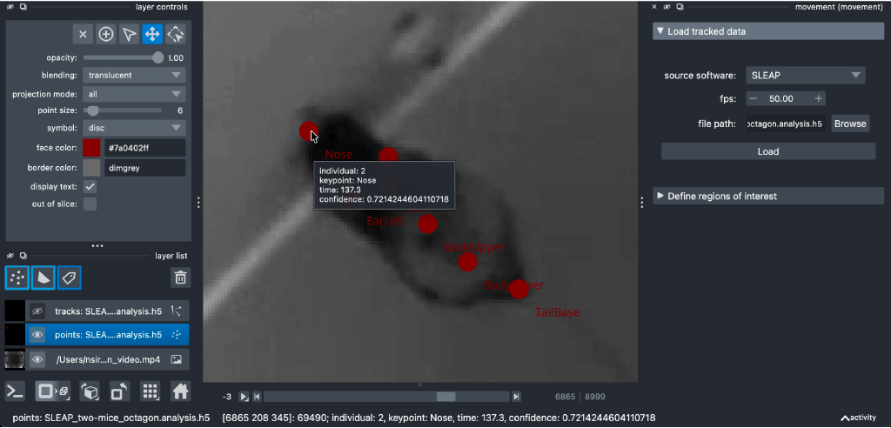
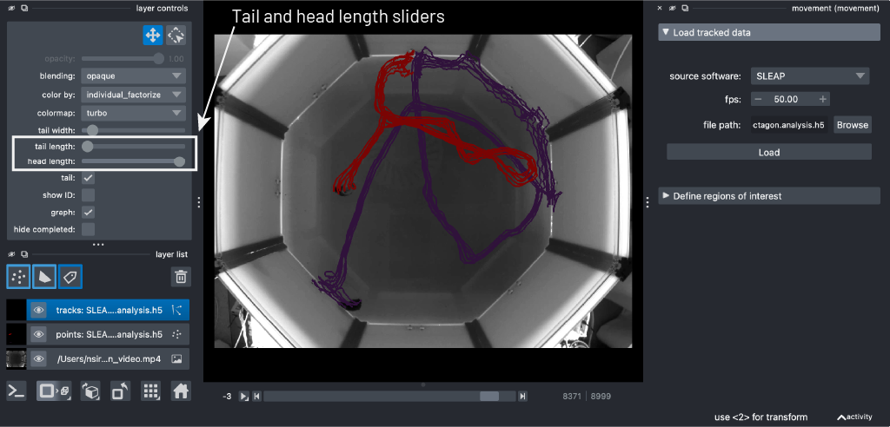
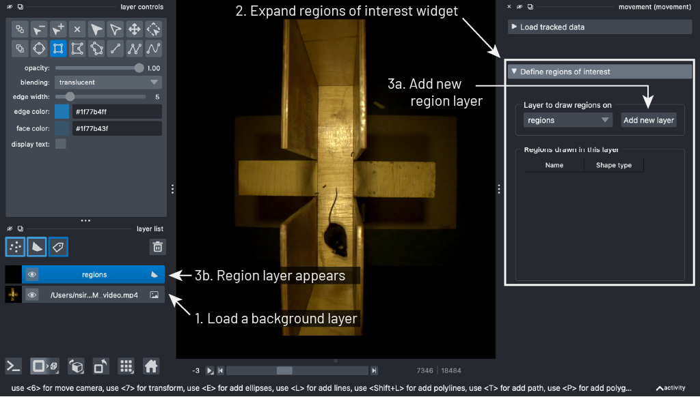
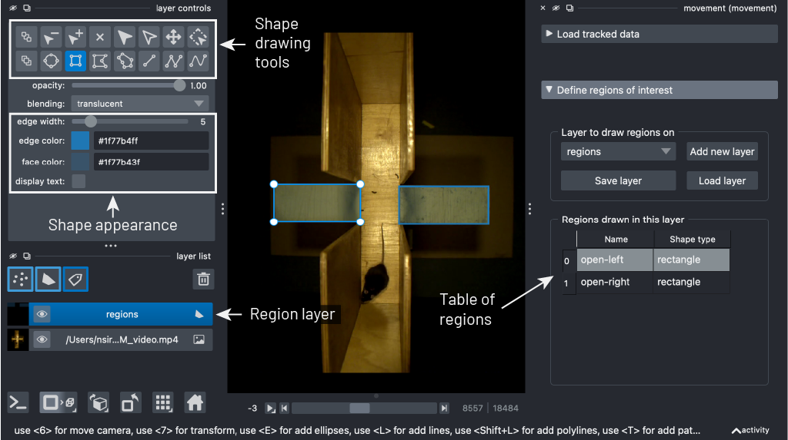

(target-gui)=
# Graphical User Interface

The `movement` graphical user interface (GUI), powered by our custom plugin for
[napari](napari:), makes it easy to view and explore `movement`
motion tracks. Currently, you can use it to
visualise 2D [movement datasets](target-poses-and-bboxes-dataset)
as points, tracks, and rectangular bounding boxes (if defined) overlaid on
video frames, as well as to define regions of interest (RoIs).

:::{warning}
The GUI is still in early stages of development but we are working on ironing
out the [kinks](movement-github:issues?q=sort%3Aupdated-desc+is%3Aissue+state%3Aopen+label%3AGUI+label%3Abug).
Please [get in touch](target-connect-with-us)
if you find any bugs or have suggestions for improvements!
:::

The `napari` plugin is shipped with the `movement` package starting from
version `0.1.0`.  To use it, you need to
[install the package](target-installation) with a method that
includes the `napari` dependency.


## Launch the GUI

To launch the `movement` GUI, type the following command in your terminal:

```sh
movement launch
```

This is equivalent to running `napari -w movement` and will open the `napari`
window with the `movement` widget docked on the
right-hand side, as in the [screenshot](target-widget-screenshot) below.

In `napari`, data is typically loaded into [layers](napari:guides/layers.html),
which can be reordered and toggled for visibility in the layers list panel.
For example, keypoint data can be added as a
[points layer](napari:howtos/layers/points.html) or a [tracks layer](napari:howtos/layers/tracks.html),
while image stacks (including videos) can be added as
[image layers](napari:howtos/layers/image.html).
Below, we'll explain how to do this.

## Load a background layer

Though this is not strictly necessary, it is usually informative to
view the keypoints overlaid on a background that provides
some spatial context. You can either [load the video](target-load-video)
corresponding to the dataset, or [load a single image](target-load-frame) (e.g., a still frame derived from that video).
You can do this by dragging and dropping the corresponding video or image file onto the
`napari` window or by using the `File > Open File(s)` menu option.


(target-load-video)=
### Load a video

Upon loading a video file into `napari`, you will be prompted
via a pop-up dialog to select the reader.
Choose the `video` reader—corresponding to the
[`napari-video`](https://github.com/janclemenslab/napari-video)
plugin—and click `OK`. You can optionally select to remember this reader
for all files with the same extension.





`napari-video` will load the video as an image stack with a slider
at the bottom that you can use to navigate through frames.
You may also use the left and right arrow keys to navigate
frame-by-frame.




Clicking on the play button will start the video playback at a default
rate of 10 frames per second. You can adjust the playback speed by right-clicking on the
play button, or by opening the `napari > Preferences` menu
(`File > Preferences` on Windows) and changing
the `Playback frames per second` setting.

(target-video-playback-limitations)=
:::{admonition} Video playback limitations
:class: warning

- The video playback may freeze or stutter if you jump
  to a specific frame while the video is playing. We recommended pausing the playback first.
- `napari-video` may struggle to play videos at a high frame rate, depending
  on your hardware, the video resolution and codec. If you experience
  performance issues, such as the video freezing or skipping frames,
  try reducing the playback speed or fall back to
  using a [single image](target-load-frame) as a background.
:::


(target-load-frame)=
### Load an image

This usually means using a still frame extracted from the video, but in theory
you could use any image that's in the same coordinate system as the
tracking data. For example, you could use a schematic diagram of the arena,
as long as it has the same width and height as the video and is
properly aligned with the tracking data.

::: {dropdown} Extracting a still frame from a video
:color: info
:icon: info

You can use the command line tool [`ffmpeg`](https://www.ffmpeg.org/)
to extract a still frame from a video.

To extract the first frame of a video:

```sh
ffmpeg -i video.mp4 -frames:v 1 first-frame.png
```

To extract a frame at a specific time stamp (e.g. at 2 seconds):

```sh
ffmpeg -i video.mp4 -ss 00:00:02 -frames:v 1 frame-2sec.png
```
:::

Dragging and dropping the image file onto the `napari` window
(or opening it via the `File` menu) will load the image
as a single 2D frame without a slider.

## Load the tracked dataset

Now you are ready to load some motion tracks over your chosen background layer.

On the right-hand side of the window you should see
an expanded `Load tracked data` menu. You can load data from
one of the [supported third-party formats](target-supported-formats)
or from a [netCDF file](target-netcdf) saved with `movement`
(expand the dropdown below for the precise requirements).

::: {dropdown} netCDF files compatible with the GUI
:color: info
:icon: info

(target-gui-compatible-netcdf)=

Only netCDF files that store a valid
[movement dataset](target-poses-and-bboxes-dataset) can be opened in the GUI.
Practically, this means:

- The dataset's `ds_type` attribute must be set to `poses` or `bboxes`.
- The data variables, dimensions, and coordinates must satisfy the
  [dataset structure requirements](target-dataset-structure) for that `ds_type`.
  For example, a `poses` dataset must provide both `position` and `confidence`.


Below is a small example showing how to save a GUI-compatible
netCDF file with `movement`:

```python
from movement.io import load_dataset
from movement.filtering import rolling_filter

ds_orig = load_dataset(
    "path/to/my_data.h5", source_software="DeepLabCut", fps=30
)

# Create a copy to avoid modifying the original dataset
ds_new = ds_orig.copy()

# Apply some processing to the position data variable.
# e.g. a rolling median filter
ds_new["position"] = rolling_filter(
  ds_orig["position"], window=5, statistic="median"
)

# Save the processed dataset to a netCDF file
ds_new.to_netcdf("my_data_processed.nc")
```

Because `ds_new` is copied from the original dataset, it retains all required
attributes and structure. Note that the data variable remains named `position`
after processing, as expected.

:::

To load tracked data in `napari`:

1. From the `source software` dropdown menu select the name of the tracking software you used to generate the data (e.g. "DeepLabCut"), or choose "movement (netCDF)".
2. Set the `fps` (frames per second) of the video the data refers to. This only changes the time units shown when you hover over a keypoint. An unknown `fps` can be set to `1`, which makes the displayed time equal to the frame index.
The `fps` option is disabled when loading a netCDF file because the `fps` is directly read from the file's attributes.
1. Select the file containing the tracked data. You can paste the path to the file directly in the text box, or you can use the file browser button.
2. Click `Load`.


The data will be loaded into the viewer as a
[points layer](napari:howtos/layers/points.html) and as a [tracks layer](napari:howtos/layers/tracks.html).
If the input file is a bounding boxes dataset, an additional napari [shapes layer](napari:howtos/layers/shapes.html) is loaded.
By default, the data is added at the top of the layer list and the points layer is selected.

For a poses dataset, you will see a view similar to this:

(target-widget-screenshot)=



And for a bounding boxes dataset, you will see a view more like the one below:




Note the additional bounding boxes layer that is loaded for bounding boxes datasets. For both poses and bounding boxes datasets, you can toggle the visibility of any of these layers by clicking on the eye icon.


### The points layer
The points layer shows the data for the current frame.

The keypoints are represented as points, colour-coded by
keypoint for single-individual datasets, or by individual for
multi-individual datasets. In datasets with one keypoint per individual, or no keypoint dimension,
the points are always colour-coded by individual.

With the [points layer](napari:howtos/layers/points.html) selected,
if we enable the `display_text` option in the
layer controls panel, the keypoint name will be displayed on the lower right corner of each point. If the
dataset has no keypoint dimension, the individual name is shown instead.

Hovering with your mouse over a point
(with the points layer selected) will
bring up a tooltip containing the properties of that point: the individual and keypoint it represents,
the point-wise confidence score (provided by the source software),
and the time in seconds (calculated based on the frame number and
the `fps` value).





Using the frame slider at the bottom of the window, you can move through
the frames of the dataset, and the points and video (if loaded) will update
in sync.

:::{admonition} Changing markers size, colour and shape
:class: tip

You can change the size, the colour and the shape of any selected markers using the
[points layer](napari:howtos/layers/points.html) controls panel.

You can use the following keyboard shortcuts to toggle the markers selection:
- To select all the markers in the current frame, press `A`.
- To select all the markers in all the loaded frames, press `Shift + A`.
- To unselect the currently selected markers, press the relevant keyboard shortcut again.

You can find all the [keyboard shortcuts](napari:guides/preferences.html#shortcuts) in the top menu of the
`napari` window, under `Preferences > Shortcuts`.

:::


### The tracks layer

The tracks layer allows us to visualise data before and after the current frame.
Remember that the current frame is determined by the position of the frame slider.

The trajectory made up of all positions of a keypoint on all frames before the current frame is called _tail_.
Similarly, its trajectory on all frames after the current frame is called _head_.

Both tail and head tracks are represented as lines connecting a single keypoint across frames. The colour of the tracks follows
the colour of the markers, and the length of the tracks can be adjusted in the
[tracks layer](napari:howtos/layers/tracks.html) controls panel, with the `tail length` and `head length` sliders.

When the `tail length` slider is at its maximum position, the tail track show the trajectory of the
keypoints from the start of the video until the current frame. When the `head length` slider is at its maximum position,
the head track shows the trajectory of the keypoints from the current frame until the end of the video.

For example, in the screenshot below, we can see from the tracks layer control panel that the
selected layer shows the trajectories of the keypoints from the current frame until the
end of the video.





You can also use the [tracks layer](napari:howtos/layers/tracks.html) controls panel to
change the colormap of a selected tracks layer.


:::{admonition} Some caveats regarding the  [tracks layer](napari:howtos/layers/tracks.html)
:class: warning

- Currently there is no support in `napari` for fine control
over the length of the tail and head tracks. However, we are
working on a workaround, stay tuned!

- You may occasionally see a warning message in the GUI upon loading a datafile, that says:
  ```bash
  UserWarning: Previous color_by key 'keypoint_factorized'
  not present in features. Falling back to track_id!
  ```
  This is a known issue and can be safely ignored. It does not currently affect the functionality of the GUI.

- Also note that currently the `show ID` checkbox in the [tracks layer](napari:howtos/layers/tracks.html) controls panel refers to
an internal napari track ID, rather than the individual or the keypoint ID. This is a known issue and we are working on a fix or workaround.
:::

### The boxes layer

The boxes layer is loaded for bounding boxes datasets only. It shows the bounding boxes for the current frame, as rectangles color-coded by individual.

The name of the individual is shown in the lower left of the bounding box by default. This can be toggled by selecting the [shapes layer](napari:howtos/layers/shapes.html) in the layer list and clicking the `display text` checkbox in the layer controls panel.

As with tracks and points, you can use the frame slider at the bottom of the viewer to move through the frames of the dataset. This will update the bounding boxes and the rest of the loaded data in sync.

:::{admonition} Changing bounding box size, colour and shape
:class: tip

You can change edge and face colour as well as the positions of a bounding box's corner vertices using the
[shapes layer](napari:howtos/layers/shapes.html) controls panel.

You can use the following keyboard shortcuts to toggle the bounding boxes selection:
- To select all the bounding boxes in the current frame, enable the select shapes tool (`5` or `S`) and press `A`.
- To deselect, click off of the bounding boxes.
- Individual vertices can be selected instead of the entire rectangle using the select vertex tool: `4` or `D`.

You can find all the [keyboard shortcuts](napari:guides/preferences.html#shortcuts) in the top menu of the
`napari` window, under `Preferences > Shortcuts`.

:::

## Define regions of interest

The `Define regions of interest` widget allows you to draw shapes on the
viewer and use them as regions of interest (RoIs) for analysis.

Each shape you draw represents a static region
that remains fixed across all frames.

Regions can be organised into multiple **region layers**—specialised
`napari` [shapes layers](napari:howtos/layers/shapes.html)
that are managed by the widget.

:::{admonition} Terminology
:class: note

**Shape**
: Any geometric object you draw on the `napari` canvas
  (e.g. a polygon or a line).

**Region**
: A shape that is managed via this widget and can be used as a
  `movement` region of interest (RoI) for analysis.

All regions are shapes, but not all shapes are regions.
Similarly, a `movement` region layer is a `napari` shapes layer,
but not all shapes layers are region layers.
:::


### Create a region layer

Start by creating a region layer, which will serve as a container for the
regions you draw. To do this:

1. Ensure a [background layer](target-load-video) is loaded so that you
   can see where you are drawing.
2. Expand the `Define regions of interest` menu on the right-hand side
   of the `napari` window.
3. Click the `Add new layer` button.

This will create a new [shapes layer](napari:howtos/layers/shapes.html)
in the layer list and select it. The layer is
automatically assigned a colour from a fixed palette, and it appears
in the layer dropdown within the widget.
The layer's default name is `regions`, but you can change it
by double-clicking on it in the layer list (as for any `napari` layer).



### Draw and edit regions

With the region layer selected, you can use the native `napari` shape tools
in the layer controls panel to draw shapes on the canvas.
Convenient keyboard shortcuts are available to select the shape drawing tools,
for example:

- `R`: rectangle tool
- `E`: ellipse tool
- `P`: polygon tool
- `L`: line tool

Tools are also provided for selecting, moving, transforming,
and deleting shapes, as well as for editing their vertices.
You can also copy-paste shapes within a layer.
See the [napari shapes layer guide](napari:howtos/layers/shapes.html) for
details on the drawing tools and how to use them.

Each shape you draw is automatically added to the widget's table of regions,
and auto-assigned a unique name (e.g. `region`, `region [1]`, etc.).
Each table row displays the region's name and shape type.



You can interact with the table in the following ways:

- **Select**: clicking a row in the table selects the corresponding shape
  on the canvas, and vice versa. This makes it easy to identify which
  shape corresponds to which table entry.
- **Rename**: double-click the name cell of a region to edit its name.
  Press `Enter` to confirm the change or `Escape` to cancel.
- **Delete**: select a shape on the canvas and press `Delete` (or
  `Backspace`) to remove it. The corresponding row will be removed from
  the table.

:::{admonition} Changing shape appearance
:class: tip

You can change the edge colour, face colour, edge width, and opacity of
shapes by selecting a shape (or multiple shapes)
and using the `napari` layer controls panel.
Once a shape's appearance has been adjusted, all subsequent shapes drawn in
the same layer will inherit those properties by default.

To display region names on the canvas, tick the `display text` checkbox
in the layer controls panel. The text colour follows the shape's edge
colour.
:::

### Save and load regions

Save and load functionality for region layers is coming soon.
You will be able to save a region layer to a GeoJSON file,
and load it back later or share it with others.

This will also enable you to import regions you have drawn in the GUI
into Python using the {func}`~movement.roi.load_rois` function.

**Stay tuned!**

### Working with multiple region layers

You can create multiple region layers to group related regions together.
For example, you might use one layer for "nesting zones" and another for
"foraging zones".

To add another region layer, click the `Add new layer`
button again. You can switch between region layers using the dropdown
to the left of the `Add new layer` button, or by selecting the layer
directly in the `napari` layer list—both are kept in sync.
The regions table updates to show only the shapes belonging
to the selected layer.
