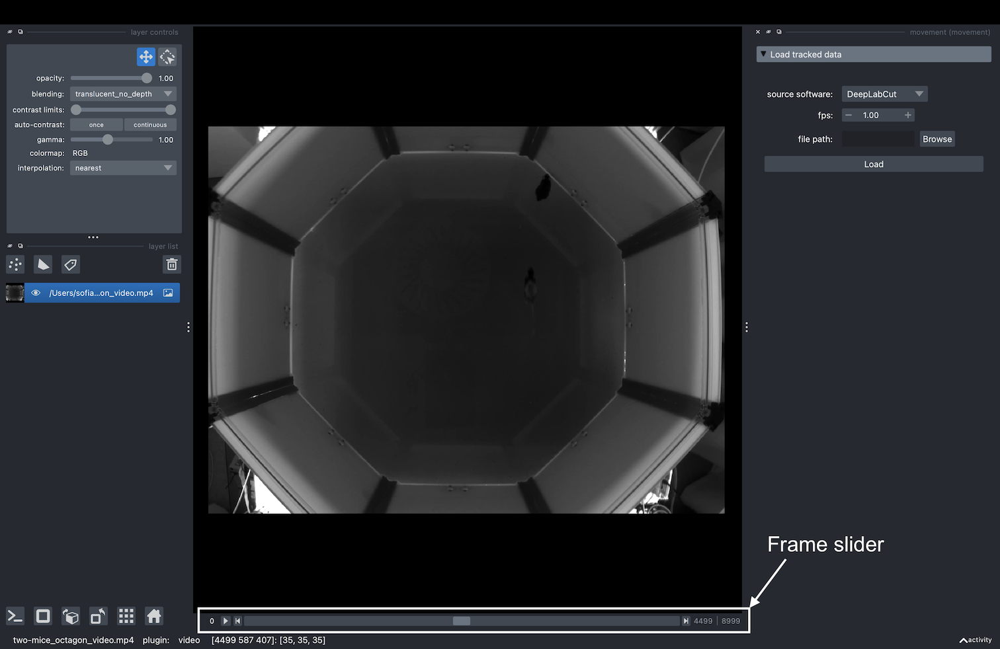
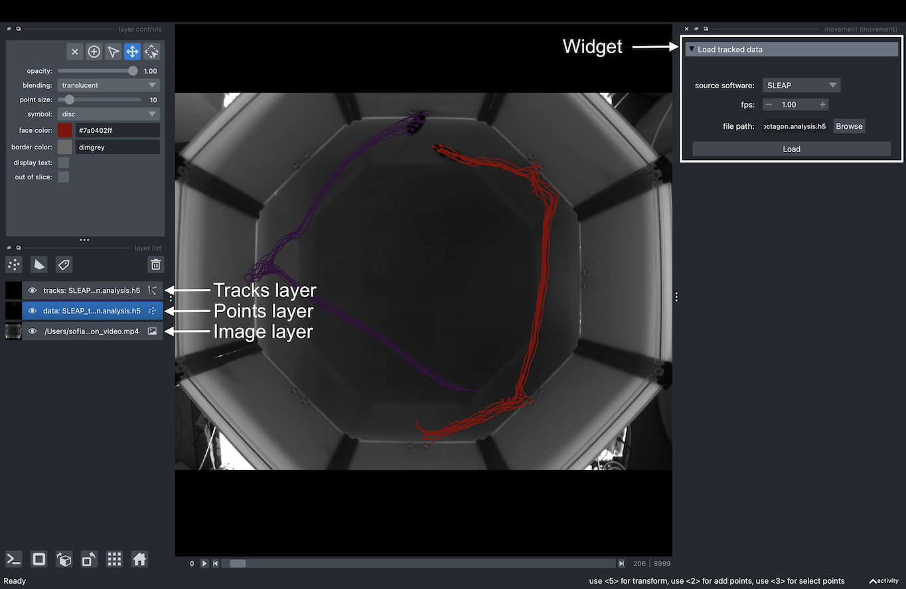

(target-gui)=
# Graphical User Interface

The `movement` graphical user interface (GUI), powered by our custom plugin for
[napari](napari:), makes it easy to view and explore `movement`
motion tracks. Currently, you can use it to
visualise 2D [movement datasets](target-poses-and-bboxes-dataset)
as points, tracks, and rectangular bounding boxes (if defined) overlaid on video frames.

:::{warning}
The GUI is still in early stages of development but we are working on ironing
out the [kinks](movement-github:issues?q=sort%3Aupdated-desc+is%3Aissue+state%3Aopen+label%3AGUI+label%3Abug).
Please [get in touch](target-get-in-touch)
if you find any bugs or have suggestions for improvements!
:::

The `napari` plugin is shipped with the `movement` package starting from
version `0.1.0`.  To use it, you need to
[install the package](target-installation) with a method that
includes the `napari` dependency.


## Launch the GUI

To launch the `movement` GUI, type the following command in your terminal:

```sh
movement launch
```

This is equivalent to running `napari -w movement` and will open the `napari`
window with the `movement` widget docked on the
right-hand side, as in the [screenshot](target-widget-screenshot) below.

In `napari`, data is typically loaded into [layers](napari:guides/layers.html),
which can be reordered and toggled for visibility in the layers list panel.
For example, keypoint data can be added as a
[points layer](napari:howtos/layers/points.html) or a [tracks layer](napari:howtos/layers/tracks.html),
while image stacks (including videos) can be added as
[image layers](napari:howtos/layers/image.html).
Below, we'll explain how to do this.

## Load a background layer

Though this is not strictly necessary, it is usually informative to
view the keypoints overlaid on a background that provides
some spatial context. You can either [load the video](target-load-video)
corresponding to the dataset, or [load a single image](target-load-frame) (e.g., a still frame derived from that video).
You can do this by dragging and dropping the corresponding video or image file onto the
`napari` window or by using the `File > Open File(s)` menu option.


(target-load-video)=
### Load a video

Upon loading a video file into `napari`, you will be prompted
via a pop-up dialog to select the reader.
Choose the `video` reader—corresponding to the
[`napari-video`](https://github.com/janclemenslab/napari-video)
plugin—and click `OK`. You can optionally select to remember this reader
for all files with the same extension.


`napari-video` will load the video as an image stack with a slider
at the bottom that you can use to navigate through frames.
You may also use the left and right arrow keys to navigate
frame-by-frame.




Clicking on the play button will start the video playback at a default
rate of 10 frames per second. You can adjust the playback speed by right-clicking on the
play button, or by opening the `napari > Preferences` menu
(`File > Preferences` on Windows) and changing
the `Playback frames per second` setting.

(target-video-playback-limitations)=
:::{admonition} Video playback limitations
:class: warning

- The video playback may freeze or stutter if you jump
  to a specific frame while the video is playing. We recommended pausing the playback first.
- `napari-video` may struggle to play videos at a high frame rate, depending
  on your hardware, the video resolution and codec. If you experience
  performance issues, such as the video freezing or skipping frames,
  try reducing the playback speed or fall back to
  using a [single image](target-load-frame) as a background.
:::


(target-load-frame)=
### Load an image

This usually means using a still frame extracted from the video, but in theory
you could use any image that's in the same coordinate system as the
tracking data. For example, you could use a schematic diagram of the arena,
as long as it has the same width and height as the video and is
properly aligned with the tracking data.

::: {dropdown} Extracting a still frame from a video
:color: info
:icon: info

You can use the command line tool [`ffmpeg`](https://www.ffmpeg.org/)
to extract a still frame from a video.

To extract the first frame of a video:

```sh
ffmpeg -i video.mp4 -frames:v 1 first-frame.png
```

To extract a frame at a specific time stamp (e.g. at 2 seconds):

```sh
ffmpeg -i video.mp4 -ss 00:00:02 -frames:v 1 frame-2sec.png
```
:::

Dragging and dropping the image file onto the `napari` window
(or opening it via the `File` menu) will load the image
as a single 2D frame without a slider.

## Load the tracked dataset

Now you are ready to load some motion tracks over your chosen background layer.

On the right-hand side of the window you should see
an expanded `Load tracked data` menu. To load tracked data in napari:
1. Select one of the [supported formats](target-supported-formats) from the `source software` dropdown menu.
2. Set the `fps`  (frames per second) of the video the data refers to. Note this will only affect the units of the time variable shown when hovering over a keypoint. If the `fps` is not known, you can set it to 1, which will effectively make the time variable equal to the frame number.
3. Select the file containing the tracked data. You can paste the path to the file directly in the text box, or you can use the file browser button.
4. Click `Load`.

The data will be loaded into the viewer as a
[points layer](napari:howtos/layers/points.html) and as a [tracks layer](napari:howtos/layers/tracks.html).
If the file format includes height and width data for bounding boxes, it is loaded as a napari [shapes layer](napari:howtos/layers/shapes.html).
By default, the data is added at the top of the layer list and the points layer is selected.

For a poses dataset, you will see a view similar to this:

(target-widget-screenshot)=



And for a bounding boxes dataset, you will see a view more like the one below:


Notice the layers on the left-hand side list: the
image layer, that holds the background information (i.e., the loaded video or image), the points layer and the tracks layer. Bounding boxes have a fourth layer, the shapes layer.
You can toggle the visibility of each of these layers by clicking on the eye icon.


### The points layer
The points layer shows the data for the current frame.

The keypoints are represented as points, colour-coded by
keypoint for single-individual datasets, or by individual for
multi-individual datasets. In datasets with one keypoint per individual, or no keypoint dimension,
the points are always colour-coded by individual.

With the [points layer](napari:howtos/layers/points.html) selected,
if we enable the `display_text` option in the
layer controls panel, the keypoint name will be displayed on the lower right corner of each point. If the
dataset has no keypoint dimension, the individual name is shown instead.

Hovering with your mouse over a point
(with the points layer selected) will
bring up a tooltip containing the properties of that point: the individual and keypoint it represents,
the point-wise confidence score (provided by the source software),
and the time in seconds (calculated based on the frame number and
the `fps` value you provided).


Using the frame slider at the bottom of the window, you can move through
the frames of the dataset, and the points and video (if loaded) will update
in sync.

:::{admonition} Changing markers size, colour and shape
:class: tip

You can change the size, the colour and the shape of any selected markers using the
[points layer](napari:howtos/layers/points.html) controls panel.

You can use the following keyboard shortcuts to toggle the markers selection:
- To select all the markers in the current frame, press `A`.
- To select all the markers in all the loaded frames, press `Shift + A`.
- To unselect the currently selected markers, press the relevant keyboard shortcut again.

You can find all the [keyboard shortcuts](napari:guides/preferences.html#shortcuts) in the top menu of the
`napari` window, under `Preferences > Shortcuts`.

:::


### The tracks layer

The tracks layer allows us to visualise data before and after the current frame.
Remember that the current frame is determined by the position of the frame slider.

The trajectory made up of all positions of a keypoint on all frames before the current frame is called _tail_.
Similarly, its trajectory on all frames after the current frame is called _head_.

Both tail and head tracks are represented as lines connecting the keypoints
of the same individual across frames. The colour of the tracks follows
the colour of the markers, and the length of the tracks can be adjusted in the
[tracks layer](napari:howtos/layers/tracks.html) controls panel, with the `tail length` and `head length` sliders.

When the `tail length` slider is at its maximum position, the tail track show the trajectory of the
keypoints from the start of the video until the current frame. When the `head length` slider is at its maximum position,
the head track shows the trajectory of the keypoints from the current frame until the end of the video.

For example, in the screenshot below, we can see from the tracks layer control panel that the
selected layer shows the trajectories of the keypoints from the current frame until the
end of the video.


You can also use the [tracks layer](napari:howtos/layers/tracks.html) controls panel to
change the colormap of a selected tracks layer.


:::{admonition} Some caveats regarding the  [tracks layer](napari:howtos/layers/tracks.html)
:class: warning

- Currently there is no support in `napari` for fine control
over the length of the tail and head tracks. However, we are
working on a workaround, stay tuned!

- You may occasionally see a warning message in the GUI upon loading a datafile, that says:
  ```bash
  UserWarning: Previous color_by key 'keypoint_factorized'
  not present in features. Falling back to track_id!
  ```
  This is a known issue and can be safely ignored. It does not currently affect the functionality of the GUI.

- Also note that currently the `show ID` checkbox in the [tracks layer](napari:howtos/layers/tracks.html) controls panel refers to
an internal napari track ID, rather than the individual or the keypoint ID. This is a known issue and we are working on a fix or workaround.
:::

### The shapes layer

The shapes layer allows us to visualize the bounding boxes of data for the current frame.

Bounding boxes are represented as rectangles color-coded by individual.

With the [shapes layer](napari:howtos/layers/shapes.html) selected, if we enable the `display text` checkbox from the layer controls panel the individual name will be displayed in the lower left of the bounding box.

As with tracks and points, you can use the frame slider at the bottom of the viewer to move through the frames of the dataset, updating the points, tracks, bounding boxes, and video (if loaded) in sync.
