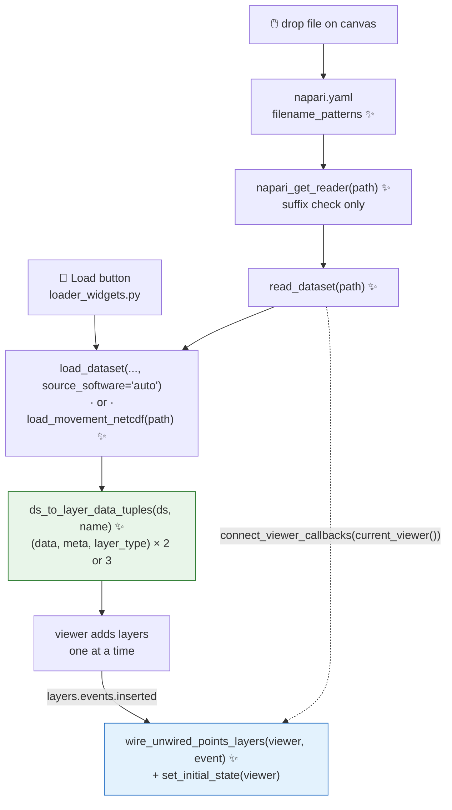

# Proposal for Drag-and-drop loading of tracked data in the movement napari plugin

## Description

**What is this PR?**

This PR is a detailed plan on how to implement the drag-and-drop functionality requested in [#960](https://github.com/neuroinformatics-unit/movement/issues/960).

The plan has been generated discussing with Claude Code but is meant to be read by humans. The idea is to present the suggested implementation in detail,so that we can discuss it with @neuroinformatics-unit/movement-active-devs before we implement it.

This is an attempt at exploring different ways in which we can implement AI in our workflows, motivated by the idea that generating AI-aided code is now faster, but the discussion is the bottleneck

**Why is the proposed feature needed?**

Getting tracked data into the viewer today requires opening the movement widget, picking the source software from a combo box, setting fps and browsing for a file ([movement/napari/loader_widgets.py](movement/napari/loader_widgets.py)). The issue is discussed in detail in [#960](https://github.com/neuroinformatics-unit/movement/issues/960).

For videos an images, users can already drag-and-drop the file on the canvas, which is super convenient ([docs/source/user_guide/gui.md:43](docs/source/user_guide/gui.md#L43)). It would be great if we supported the same for pose track files too.

Since PR [#920](https://github.com/neuroinformatics-unit/movement/pull/920) the backend can already infer the `source_software` given a file without asking the user. So maybe we are well positioned to implement this feature now.

**References**
* This PR proposes an implementation that addresses [#960](https://github.com/neuroinformatics-unit/movement/issues/960)
* Relates indirectly to [#959](https://github.com/neuroinformatics-unit/movement/issues/959) (netCDF via `load_dataset`)
* Relates indirectly to [#896](https://github.com/neuroinformatics-unit/movement/pull/896) (dynamic loader UI exposing relevant kwargs).


## Key aspects of suggested implementation

### napari Reader Contribution
We will need to implement a napari [Contribution](https://napari.org/stable/plugins/technical_references/contributions.html) of type `reader`.

A Contribution allows us to extend napari functionality. The `reader` type allows us to extend the file reading functionalities specifically. Contributions are defined in the plugin manifest (the `movement/napari/napari.yaml` file).

For our specific case, the manifest currently only declares the meta widget. Adding a reader means adding a `commands` entry pointing at the hook function, plus a `readers` entry with the filename patterns that trigger it (see example [here](https://napari.org/stable/plugins/technical_references/contributions.html#readercontribution)):

```yaml
name: movement
display_name: movement
contributions:
  commands:
    - id: movement.make_widget
      python_name: movement.napari.meta_widget:MovementMetaWidget
      title: movement
    # ------ new command for the reader hook ------------
    - id: movement.get_reader
      python_name: movement.napari.reader:napari_get_reader # new movement.napari.reader.py
      title: Open tracked data with movement
   # ----------------------------------------------------
  widgets:
    - command: movement.make_widget
      display_name: movement
  # --------- new reader contribution --------------
  readers:
    - command: movement.get_reader
      filename_patterns: ["*.h5", "*.csv", "*.slp", "*.nwb", "*.nc"]
      accepts_directories: false
   # ----------------------------------------------------
```

For the filenames that survive the pattern test, napari will call the function returned by the `command` defined in the plugin manifest (which here points to a function called `napari_get_reader()`).

`napari_get_reader()` returns a callable: a **reader function** for the given input path. The reader is meant to be cheap: the napari docs describe it as lightweight validation without loading the full file content (e.g. peeking at a header rather than loading fully). `napari_get_reader()` should return a reader function or `None` to decline (and then napari moves on to reader Contributions from other plugins).

The reader function returned by `napari_get_reader()` should take the path(s) and return a list of `LayerData` tuples `(data, attributes, layer_type)` where `layer_type` is `'points'`, `'tracks'`, `'shapes'`, etc. (defaults to `'image'` if omitted).

On conflicts (i.e. when the filename patterns from several plugin readers match a single file), napari presents a reader-choice dialog with a "remember this choice" option that gets written to user settings.

Remember that the mapping suffix to software isn't 1:1 (e.g. there are multiple source software that produce `.csv` files, see [the guide](https://movement.neuroinformatics.dev/latest/user_guide/input_output.html#supported-third-party-formats)). We can only restrict what passes to `napari_get_reader()` by file suffix.

napari docs provide a [Readers Contribution guide](https://napari.org/stable/plugins/building_a_plugin/guides.html#readers-contribution-guide).

### Layer wiring

A reader contribution defined in `napari.yaml` is registered by npe2 at install time. This means it runs whether or not any `movement` widget has ever been instantiated.

The reader path returns `(data, attributes, layer_type)` tuples that napari turns into layers directly. This is different from the path of creation of `movement` napari layers through the form widget: in that case, they go through `DataLoader._add_points_layer` / `_add_tracks_layer`, which is where relevant wiring happens .

> [!NOTE]
> **The following assumes `fix/layer-wiring-lifetime`.**
> That branch moves every sync callback out of `DataLoader` and into
> module-level functions in
> [movement/napari/layer_wiring.py](movement/napari/layer_wiring.py), together
> with the metadata keys ([:32-35](movement/napari/layer_wiring.py#L32-L35)).
> The viewer-level connections are made by `connect_viewer_callbacks(viewer)`
> ([:44](movement/napari/layer_wiring.py#L44)).

The **per-layer** and **viewer-level** connections are defined in `movement/napari/layer_wiring.py`. These are the wirings that would need to be manually wired during drag-and-drop:
* three things on the Points layer — connect `events.data`, set `editable`, and resolve `TRACKS_LAYER_KEY` to the companion Tracks object
* the viewer wirings, that can be done with one `connect_viewer_callbacks` call.

For a more detailed description, see the collapsed table below.


<details>
<summary>Table: per callback details </summary>

| function (`layer_wiring.py`) | needs manual wiring on drop? |
|---|---|
| `on_points_data_changed` | **Yes** to`layer.events.data.connect(...)`, but it is now a plain function, so the connect is a one-liner with no widget involved. |
| `sync_tracks_layer` | **Yes, indirectly** — no connection of its own, but it reads `points_layer.metadata[TRACKS_LAYER_KEY]` ([:208](movement/napari/layer_wiring.py#L208)), which holds a *layer object* and so can't be put in a `LayerDataTuple`. Must be resolved after both layers exist. |
| `remove_from_tracks_layer` | **Yes, indirectly** — same `TRACKS_LAYER_KEY` reference ([:232](movement/napari/layer_wiring.py#L232)). Resolved by the same step. |
| `set_tracks_layer_data` | No — a pure helper called by the two functions above; nothing to wire. |
| `set_point_symbol_by_edited` | No — `symbol` *is* a `Points.__init__` kwarg, so the edited-point symbols can be pre-computed into the tuple's `attributes` instead of being applied post-creation as they are today ([loader_widgets.py:368](movement/napari/loader_widgets.py#L368)). |
| `frame_axis_is_sliced` | No — a pure query, now taking `viewer` explicitly ([:123](movement/napari/layer_wiring.py#L123)). But its *result* has to be applied once as `layer.editable` at insert time ([loader_widgets.py:364](movement/napari/loader_widgets.py#L364)), and `editable` is **not** a `Points.__init__` kwarg, so that one assignment is manual. |
| `update_points_layers_editable` | No — connected to `viewer.dims.events.order`/`ndisplay` inside `connect_viewer_callbacks` ([:66-67](movement/napari/layer_wiring.py#L66-L67)) and it re-scans *all* layers carrying `POINTS_LAYER_KEY`. Free for dropped layers, provided the reader sets `metadata[POINTS_LAYER_KEY] = True` — but it only fires on a dims change, hence the one-off `editable` assignment in the row above. |
| `update_frame_slider_range` | No — connected to `viewer.layers.events.inserted`/`removed` inside `connect_viewer_callbacks` ([:57-60](movement/napari/layer_wiring.py#L57-L60)), so it fires on the drop itself. |
| `connect_viewer_callbacks` | **Yes, but trivial** — the reader calls `connect_viewer_callbacks(napari.current_viewer())` before returning. Idempotent, so a drop with the widget already open is a no-op, and a drop without it wires the viewer anyway. |

</details>


#### How will the wiring be implemented?

The reader would call `connect_viewer_callbacks` to set up the viewer connections.

In `layer_wirings.py`, we capture the additionally required per-layer connections in a new `wire_unwired_points_layers` function.

```python
# layer_wiring.py
def wire_unwired_points_layers(viewer, event=None):
    """Wire up any movement Points layers that aren't wired up yet."""
    FOR EACH Points layer IN viewer.layers:      # <---- full rescan, not event.value
        IF NOT metadata[POINTS_LAYER_KEY]:
            skip  # not a "movement" layer
        IF metadata HAS TRACKS_LAYER_KEY:
            skip   # already wired

        metadata[TRACKS_LAYER_KEY] = viewer.layers[metadata[TRACKS_LAYER_NAME_KEY]]
        layer.events.data.connect(on_points_data_changed)
        layer.editable = frame_axis_is_sliced(viewer)
        set_point_symbol_by_edited(layer)
```

The full of the layers rescan matters: napari inserts a reader's layers one at a time, so when
the Points layer's `inserted` fires, the Tracks layer does not exist yet. The
Points insert event wires what it can, and the Tracks insert re-scans and resolves
`TRACKS_LAYER_KEY`. Step 4 has the full argument, including the two alternatives
to a rescan and why they are worse.

The `wire_unwired_points_layers` function would be connected to `viewer.layers.events.inserted` from inside `connect_viewer_callbacks`.
```diff
 # layer_wiring.py
 def connect_viewer_callbacks(viewer) -> None:
     for action in ("inserted", "removed"):
         getattr(viewer.layers.events, action).connect(
             partial(update_frame_slider_range, viewer)
         )
+    viewer.layers.events.inserted.connect(
+        partial(wire_unwired_points_layers, viewer)
+    )
```

The reader would then call `connect_viewer_callbacks`, so the connection is in place whether or not the widget was ever opened.
```diff
 # reader.py
 def read_dataset(path):
     ds = load_dataset(path, ...)
+    connect_viewer_callbacks(napari.current_viewer())
     return ds_to_layer_data_tuples(ds, Path(path).name)
```

Note that `read_dataset` is the reader function returned by `napari_get_reader`.

### Set initial state
There is an additional function worth running manually too for parity with the Load button: `_set_initial_state` ([loader_widgets.py:322](movement/napari/loader_widgets.py#L322)), which puts the slider at frame 0 and makes the Points layer active.

`_set_initial_state` only touches `viewer.dims` and `viewer.layers.selection`, so it can move to `layer_wiring.py` as `set_initial_state(viewer)`, with two additions to the original:

```python
# layer_wiring.py
def set_initial_state(viewer):
    """Set slider at first frame and last movement Points layer as active."""
    # get movement Points layers in viewer
    points_layers = [
        ly for ly in viewer.layers
        if isinstance(ly, Points) and ly.metadata.get(POINTS_LAYER_KEY)
    ]
    IF no points_layers:
        return   # guard: skip if no movement point layers in the viewer
    viewer.dims.current_step = (0,) + viewer.dims.current_step[2:]
    viewer.layers.selection.active = points_layers[-1]
```

The two additions are the `POINTS_LAYER_KEY` filter (the original selects the
last `Points` layer of any origin, [loader_widgets.py:332-334](movement/napari/loader_widgets.py#L332-L334))
and the empty-list guard, which is now *required*: as an insert handler this can
fire in a viewer that holds no movement layers at all, where the original's
`[...][-1]` would raise `IndexError`.


Now the widget can call it as:
```diff
 # loader_widgets.py
-        self._set_initial_state()
+        set_initial_state(self.viewer)
```

And in `layer_wiring.py` we edit `wire_unwired_points_layers` as:

```diff
 # layer_wiring.py
 def wire_unwired_points_layers(viewer, event=None):
     ...
+   # if the layer just inserted is of "movement" type,
+   # set initial state of the viewer
+   IF event is None OR event.value.metadata HAS MOVEMENT_LAYER_KEY:
+       set_initial_state(viewer)
```

`event.value` is the layer napari just inserted (napari's `EventedList.inserted`
emits `index` and `value`). The `event is None` branch keeps the function
callable by hand — the module's other handlers, `update_frame_slider_range`
([:80](movement/napari/layer_wiring.py#L80)) and
`update_points_layers_editable` ([:142](movement/napari/layer_wiring.py#L142)),
take `event=None` for the same reason, and tests will want it.

Note that we would need to add the "movement" key to all movement layers (right
now only the Points layer is identifiable as ours). If not, the Points layer
would be de-selected by the subsequent Tracks insert (and, for bboxes, the
Shapes insert), since napari makes each newly inserted layer the active one.
Only the selection is at stake here — the slider stays at frame 0 either way.

**Where do we add the keys?** In one place: the three `metadata` dicts that
`ds_to_layer_data_tuples` assembles (Step 1). After that refactor, both
the reader path *and* the Load button path build their layers from those tuples, so
`_add_points_layer` / `_add_tracks_layer` / `_add_boxes_layer` stop writing
metadata of their own and there is nothing to keep in sync.

### Which files are drag-and-droppable?

We rely on `load_dataset` for the drag-and-drop, so what is droppable is what the loader registry supports, which is not the same as what the widget's combo box offers:

|                             | `load_dataset` | combobox |
|---|---|---|
| DLC, LP, SLEAP, VIA-tracks  | ✅ | ✅ |
| Anipose, NWB                | ✅ | ❌ |
| movement `.nc`              | ❌ (until #959) | ✅ |

* So Anipose and NWB files will be droppable, but not selectable through the
  form widget yet.
* ROI `.geojson`/`.json` drops are out of scope.


## Detailed implementation

### At a glance

Both paths — the Load button and a canvas drop — converge on one pure function
(`ds_to_layer_data_tuples`), and both get their live behaviour from one insert
handler (`wire_unwired_points_layers`). ✨ = new in this PR.



### The seven changes

| # | Change | Signature / diff |
|---|---|---|
| 1 | **Extract layer construction** into a viewer-free function, so the reader and the Load button build layers identically | <pre># new movement/napari/layers.py<br>def ds_to_layer_data_tuples(<br>    ds, name_suffix<br>) -> list[FullLayerData]: ...</pre> |
| 2 | **Extract the netCDF path** — the body of `DataLoader._load_netcdf_file`, raising instead of `show_error`. Deleted once #959 lands | <pre># movement/napari/layers.py<br>def load_movement_netcdf(path) -> xr.Dataset: ...</pre> |
| 3 | **Add the reader contribution** — suffix matching in the hook; loading, inference and error reporting in the reader function it returns | <pre># new movement/napari/reader.py<br>def napari_get_reader(path) -> ReaderFunction \| None:<br>    if any suffix unsupported:      # mixed multi-file drop<br>        return None<br>    return read_dataset             # the reader function<br><br>def read_dataset(paths) -> list[FullLayerData]:<br>    ds = load_dataset(path, source_software="auto")<br>    connect_viewer_callbacks(napari.current_viewer())<br>    return ds_to_layer_data_tuples(ds, Path(path).name)</pre> plus `commands` + `readers` in `napari.yaml` |
| 4 | **Wire up the layers the reader created** — a full rescan on every insert, also applying `set_initial_state` | <pre># layer_wiring.py<br>def wire_unwired_points_layers(viewer, event=None): ...<br><br> def connect_viewer_callbacks(viewer):<br>+    viewer.layers.events.inserted.connect(<br>+        partial(wire_unwired_points_layers, viewer)<br>+    )</pre> |
| 5 | **Leave the widget's suffix dicts alone** — they duplicate `get_supported_source_software()`, but open PR #896 is already fixing exactly that | *(no code)* |
| 6 | **Tests** — see § *Overview of tests to write*. The load-bearing one is parity: a dropped file must produce the same layers as the Load button | *(see below)* |
| 7 | **Docs** — drag-and-drop in `docs/source/user_guide/gui.md`; see § *Files changed* | *(see below)* |

### Steps in detail

Each step below expands to the full argument.

<details>
<summary><b>Step 1 — Extract layer construction into a reusable, viewer-free function</b></summary>

**New file: `movement/napari/layers.py`** (could also fold into `convert.py`).

```python
def ds_to_layer_data_tuples(
    ds: xr.Dataset, name_suffix: str
) -> list[FullLayerData]:
    """Build napari (data, meta, layer_type) tuples from a movement dataset."""
```

It absorbs, near-verbatim, the viewer-free parts of:

- `DataLoader._format_data_for_layers` ([:238-262](movement/napari/loader_widgets.py#L238-L262)) —
  `ds_to_napari_layers`, the `data_not_nan` mask, the `position_is_nan` property.
- `_set_common_color_property` ([:315](movement/napari/loader_widgets.py#L315))
  and `_set_text_property` ([:334](movement/napari/loader_widgets.py#L334)).
- The style/kwargs assembly in `_add_points_layer` ([:356](movement/napari/loader_widgets.py#L356)),
  `_add_tracks_layer` ([:537](movement/napari/loader_widgets.py#L537)),
  `_add_boxes_layer` ([:562](movement/napari/loader_widgets.py#L562)) — the
  existing `PointsStyle`/`TracksStyle`/`BoxesStyle` `.as_kwargs()` calls and the
  `metadata` dicts, unchanged apart from the new `MOVEMENT_LAYER_KEY: True`
  added to all three (see Step 4).

Two changes make the metadata expressible before layers exist:

1. `TRACKS_LAYER_KEY` currently holds a *layer object*, set in `_add_tracks_layer`
   ([:559](movement/napari/loader_widgets.py#L559)). Add
   `TRACKS_LAYER_NAME_KEY = "movement_tracks_layer_name"` which the pure function
   can set (`f"tracks: {name_suffix}"`). Step 4's wiring resolves it to the
   object under the existing `TRACKS_LAYER_KEY`, so `_sync_tracks_layer` and
   `_remove_from_tracks_layer` are untouched.
2. `editable` is **not** a `Points.__init__` kwarg (verified against the pinned
   napari 0.6.6), so it stays a post-creation assignment in Step 4. Same for
   `_set_point_symbol_by_edited` ([:426](movement/napari/loader_widgets.py#L426)).

`DataLoader._on_load_clicked` then loads the dataset (branching unchanged),
calls `ds_to_layer_data_tuples`, and adds each via
`self.viewer.add_layer(Layer.create(*tup))` (`napari.layers.Layer.create` is
public API).

</details>

<details>
<summary><b>Step 2 — Extract the netCDF loading path so the reader can use it</b></summary>

`load_dataset` cannot open `.nc` files — there is no registered loader for it (that is #959) — so the reader needs a netCDF branch. The widget
already has one, in `DataLoader._load_netcdf_file`
([:272-313](movement/napari/loader_widgets.py#L272-L313)). Move its body to a
module-level function in `movement/napari/layers.py`:

```python
def load_movement_netcdf(path) -> xr.Dataset:
    """Open a movement netCDF file, raising ValueError if unusable."""
```

The logic is unchanged — `xr.open_dataset` → `rename_legacy_dimensions` →
`ds_type` must be `poses` or `bboxes` → `ValidPosesInputs.validate` /
`ValidBboxesInputs.validate` — with one difference: it **raises** instead of
`show_error(...); return None`, leaving the caller to decide how to report.
The widget wraps it and calls `show_error` with the same messages, so its
user-facing behaviour and `test_data_loader_widget.py`'s netCDF error cases are
untouched; the reader reports through its own error path (Step 3).

This one function is also the seam that disappears when #959 lands: the reader's
`.nc` branch collapses to a plain `load_dataset(path)` call and the helper is
deleted.

Note this deliberately does *not* validate third-party datasets. Those come out
of `load_dataset` already built through `ValidPosesInputs` / `ValidBboxesInputs`
(which is where `ds_type` is set,
[datasets.py:470](movement/validators/datasets.py#L470)), so re-checking them
would be a no-op. Whether the GUI's stricter-than-`load_dataset` requirements
should nevertheless be enforced at the conversion layer, for every dataset, is a
#959 design question rather than something this PR needs to settle — see
discussion point 1.

</details>

<details>
<summary><b>Step 3 — The reader contribution</b></summary>

**New file: `movement/napari/reader.py`**

```python
SUPPORTED_SUFFIXES = set().union(*get_supported_source_software().values()) | {".nc"}

def napari_get_reader(path: str | list[str]) -> ReaderFunction | None:
    """Return a reader for movement-supported files, else None."""
```

- Normalise `path` to a list and return a reader function in essentially every
  case. The manifest's `filename_patterns` already gate on exactly
  `SUPPORTED_SUFFIXES`, so a second suffix check here is almost dead code — the
  only case it catches is a *mixed* multi-file drop, where napari passes a list
  in which some paths match the patterns and some don't; return `None` for that.
  Deliberately do **not** use `None` as a general "can't read this" signal:
  inside napari it is not a graceful fall-through. For npe2 plugins the
  reader-choice dialog is built from `filename_patterns` alone
  (`get_potential_readers` → `pm.iter_compatible_readers`), *before* the hook
  runs, so declining neither hides us from the dialog nor hands off to another
  plugin — if the user picked movement, they get a `ReaderPluginError`
  ("was selected to open …, but returned no data") instead of our own message.
  Everything we can't load is therefore handled *inside* the reader function,
  via `show_error` plus the `[(None,)]` sentinel (see the error bullet below).
- Do **not** validate content in `napari_get_reader`. It runs for every candidate
  drop and `ValidVIATracksCSV` does a full `pd.read_csv`. Suffix matching only;
  inference happens in the reader function.
- Reader function, per path: `.nc` → `load_movement_netcdf(path)` (Step 2;
  becomes `load_dataset(path)` after #959), otherwise
  `load_dataset(path, source_software="auto", fps=None)`. Then
  `ds_to_layer_data_tuples(ds, Path(path).name)`. Concatenate across paths so a
  multi-file drop yields one set of layers per file.
- Per-file errors (`ValueError`/`OSError`, including `infer_source_software`'s
  "Could not infer source_software…" and `load_movement_netcdf`'s messages) →
  `show_error` naming the file and pointing at the movement widget for explicit
  source-software selection and loader kwargs; skip that file. If nothing loads,
  return `[(None,)]` (napari's "no layers" sentinel) rather than raising.

**Manifest** — [movement/napari/napari.yaml](movement/napari/napari.yaml) gains:

```yaml
  commands:
    - id: movement.get_reader
      python_name: movement.napari.reader:napari_get_reader
      title: Open tracked data with movement
  readers:
    - command: movement.get_reader
      filename_patterns: ["*.h5", "*.csv", "*.slp", "*.nwb", "*.nc"]
      accepts_directories: false
```

npe2 manifests are static, so the patterns are hard-coded — add a test asserting
they equal `get_supported_source_software()` ∪ `{".nc"}` so the two can't
silently diverge (this also becomes the tripwire when a new loader is registered).

No packaging change needed: `MANIFEST.in` ships `napari.yaml` and the entry point
already exists ([pyproject.toml:52](pyproject.toml#L52)).

</details>

<details>
<summary><b>Step 4 — Wire up layers created by the reader</b></summary>

**Why this is needed.** A reader can only hand napari *static* data —
`(data, attributes, layer_type)`. It cannot attach behaviour. But a movement
Points layer is not just data: `DataLoader` wires three live things onto it
after creation, none of which survive a `LayerDataTuple`.

| wiring | today | what it does |
|---|---|---|
| `events.data.connect(on_points_data_changed)` | [loader_widgets.py:363](movement/napari/loader_widgets.py#L363) | keeps the Tracks layer in sync when a point is dragged or deleted |
| `editable = frame_axis_is_sliced(viewer)` | [loader_widgets.py:364](movement/napari/loader_widgets.py#L364) | blocks editing when frame isn't the slider axis, so a drag can't move a point to another frame |
| `metadata[TRACKS_LAYER_KEY] = self.tracks_layer` | [loader_widgets.py:394](movement/napari/loader_widgets.py#L394) | the Points→Tracks object reference `sync_tracks_layer` needs |

Without this step the failure is not cosmetic: a user drags a point on a dropped
layer, the Points layer moves, the Tracks layer doesn't, and they silently
diverge — after which `DataSaver` writes that inconsistent state to `.nc`. Nor
can we dodge it by shipping dropped layers read-only: `editable` is not a
`Points.__init__` kwarg (see Step 1), so the reader cannot set it. Some
post-creation step is unavoidable.

**The function.** `wire_unwired_points_layers`, written out in § *Layer wiring*
above. Since `fix/layer-wiring-lifetime` it belongs in `layer_wiring.py`, not on
the widget — it changes layer state that must outlive the dock, which is exactly
the rule in that module's docstring.

**When it runs — and an ordering trap.** Connect it to
`viewer.layers.events.inserted` from inside `connect_viewer_callbacks`
([:57-60](movement/napari/layer_wiring.py#L57-L60)), alongside the existing
`update_frame_slider_range` wiring, using the same
`partial(wire_unwired_points_layers, viewer)` pattern. Two paths reach it, and both
are covered by that one connection:

1. The widget is already open — `DataLoader.__init__` called
   `connect_viewer_callbacks` ([loader_widgets.py:78](movement/napari/loader_widgets.py#L78)),
   so the drop's `inserted` events fire the handler.
2. The widget was never opened — the reader calls `connect_viewer_callbacks`
   itself before returning its tuples, so the connection is in place by the time
   napari inserts them.

No "once at the end of `__init__`" pass is needed any more: on `main` that
existed to catch layers dropped before the widget was opened, but the reader now
wires the viewer itself. (`connect_viewer_callbacks`'s `_WIRED_VIEWERS` guard
makes the double call harmless, and
`test_connect_viewer_callbacks_is_idempotent`
([tests/test_unit/test_napari_plugin/test_layer_wiring.py:94](tests/test_unit/test_napari_plugin/test_layer_wiring.py#L94))
already pins that.)

The trap: napari adds a reader's layers **one at a time**
(`_add_layers_with_plugins` loops over the returned tuples calling
`_add_layer_from_data` for each), so `inserted` fires separately per layer. When
the *Points* layer's event fires, the *Tracks* layer does not exist yet, and
resolving `TRACKS_LAYER_NAME_KEY` will fail. "Not added yet" is therefore the
common case, not an edge case — and it fails quietly: the connection and
`editable` get set, the Tracks reference doesn't, and drag-sync stays broken.

So the handler must be **idempotent and scan `viewer.layers` in full on
every insert**, never just `event.value`. The Points insert wires what it can and
leaves the reference unresolved; the Tracks insert re-scans and completes it. The
"no `TRACKS_LAYER_KEY` yet" condition is what keeps repeated scans cheap and
safe. Two alternatives are worse: returning the tracks tuple first is fragile
(it depends on napari preserving order and on nobody reordering the list later),
and deferring via a single-shot timer adds async behaviour that is awkward to
test.

The same handler also applies `set_initial_state`, so a drop gets the Load
button's "slider to frame 0, points layer active" behaviour — including the new
`MOVEMENT_LAYER_KEY` that its guard needs. See § *Set initial state* above.

No known limitation left here: with the reader calling
`connect_viewer_callbacks`, dropped layers are fully wired whether or not the
widget is ever opened, and they stay wired after it is closed. See discussion
point 2.

</details>

<details>
<summary><b>Step 5 — Deliberately *not* touching the widget's suffix dicts</b></summary>

`SUPPORTED_POSES_FILES` / `SUPPORTED_BBOXES_FILES`
([:37-56](movement/napari/loader_widgets.py#L37-L56)) duplicate
`get_supported_source_software()` and already drift from it (Anipose and NWB are
registered in the backend but missing from the combo box). **Open PR #896 fixes
exactly this** — it adds Anipose and NWB to the dropdown and changes the form's
`rowCount()` — so deriving these dicts from the registry here would collide.

Leave them alone in this PR; note in the PR description that once #896 merges,
replacing the hard-coded dicts with a `get_supported_source_software()`-derived
mapping (plus the manual netCDF entry) is a small, safe follow-up. Also worth a
rebase check: #896 rewrites `_on_source_software_changed` and the form layout,
which are adjacent to but not overlapping Steps 1 and 4.

</details>


## Files changed

| File | Change |
|---|---|
| `movement/napari/layers.py` | **new** — `ds_to_layer_data_tuples`, `load_movement_netcdf` |
| `movement/napari/reader.py` | **new** — `napari_get_reader` |
| `movement/napari/napari.yaml` | add `movement.get_reader` command + `readers` contribution |
| `movement/napari/layer_wiring.py` | add `wire_unwired_points_layers` (connected in `connect_viewer_callbacks`) , `TRACKS_LAYER_NAME_KEY` and `MOVEMENT_LAYER_KEY`; absorb `set_initial_state` |
| `movement/napari/loader_widgets.py` | delegate to the new module; `_load_netcdf_file` becomes a thin `show_error` wrapper |
| `docs/source/user_guide/gui.md` | document drag-and-drop of tracked data (§ *Load the tracked dataset*, ~line 122): the reader-choice dialog, the fps-in-frames caveat, and "use the widget for loader kwargs" |
| `docs/source/api_index.rst` | add `movement.napari.reader` / `layers` next to `convert`/`convert_roi` (lines 26-28) |
| `tests/test_unit/test_napari_plugin/test_reader.py` | **new** |
| `tests/test_unit/test_napari_plugin/test_layer_wiring.py` | add `wire_unwired_points_layers` tests, alongside the existing widget-lifetime ones |
| `tests/test_unit/test_napari_plugin/test_data_loader_widget.py` | adapt to the refactor |


## Overview of tests to write

1. **Unit — reader as a pure function** (no viewer needed, a first for this test
   package): `napari_get_reader` returns a callable for `dlc_h5_file`,
   `dlc_csv_file`, `lp_csv_file`, `sleap_slp_file`, `sleap_analysis_file`,
   `anipose_csv_file`, `via_tracks_csv`, `valid_netcdf_file`
   ([tests/fixtures/files.py](tests/fixtures/files.py)) and `None` for
   `wrong_extension_file`, `directory`, `nonexistent_file`. Reader function
   returns 2 tuples for poses, 3 for bboxes, with layer types
   `("points","tracks"[,"shapes"])` and `meta["metadata"][POINTS_LAYER_KEY] is True`.
   Bad content (`readable_csv_file`, `invalid_dstype_netcdf_file`,
   `unopenable_netcdf_file`, `invalid_netcdf_file_missing_confidence`) →
   `show_error` called, `[(None,)]` returned. Manifest patterns equal
   `get_supported_source_software()` ∪ `{".nc"}`; `npe2.PluginManifest` validates
   the YAML.
2. **Unit — parity with the widget**: for a sample file, the layer
   data/properties/metadata from `ds_to_layer_data_tuples` are identical to what
   the `loaded_data_loader` fixture ([tests/fixtures/napari.py](tests/fixtures/napari.py))
   produces via the Load button. This is the key regression guard for the refactor.
3. **Unit — layer wiring**: with `make_napari_viewer_proxy`, three cases —
   widget then `viewer.open(path, plugin="movement")`, open-then-widget, and
   **open with the widget never instantiated at all** (the case
   `fix/layer-wiring-lifetime` makes work; it is the one that would silently
   regress if the reader forgot its `connect_viewer_callbacks` call). Assert
   `TRACKS_LAYER_KEY` resolved, `editable is True`, the frame slider range
   correct, and that the existing `move_point`/`remove_point` fixtures still keep
   the Tracks layer in sync. Add a fourth case mirroring
   `test_point_edit_syncs_tracks_layer_after_widget_is_gone`
   ([test_layer_wiring.py:36](tests/test_unit/test_napari_plugin/test_layer_wiring.py#L36)):
   drop, open then close the widget, edit, sync still holds.
4. **Integration**: drop → edit → `DataSaver` save → re-open round trip, since
   [save_widget.py](movement/napari/save_widget.py) reads `POINTS_PROPERTIES_KEY`
   and `DATASET_ATTRS_KEY` off reader-created layers.


## Verifications for agent to run
* **Manual**: `movement launch`; drag a DLC `.h5`, a DLC `.csv` (confirm the
   reader-choice dialog), a `.slp`, a VIA `.csv` and a movement `.nc` — with the
   widget open and closed, and several files at once. Confirm layer names,
   colours, tooltips and slider match the Load-button result.
* `pytest tests/test_unit/test_napari_plugin tests/test_unit/test_io` and
   `pre-commit run --all-files`.


## Points to discuss

1. **Sequencing against #959.** Step 2's `load_movement_netcdf` is deleted the
   moment #959 lands, so the team may prefer to land #959 first. Related, and
   #959's call rather than this PR's: @niksirbi suggested there that
   `load_dataset` validate netCDF only *minimally*, with the GUI's stricter
   requirements enforced at the conversion layer instead — a
   `validate_ds_for_napari(ds)` at the top of `ds_to_layer_data_tuples`, giving
   the GUI-compatibility rules a single home that `gui.md` could point at. Not
   needed for drag-and-drop (third-party datasets are valid by construction) and
   a behaviour change, so it is deliberately left out here.
2. **The reader's dependency on `current_viewer()`.** The reader must call
   `connect_viewer_callbacks(napari.current_viewer())`, which assumes a non-`None`
   viewer — true for a canvas drop, worth an explicit guard for the
   headless/`viewer.open` case. The underlying gap ("reader plugins can't attach
   behaviour to the layers they create") is worth raising upstream; @TimMonko
   offered napari-side help in #960.
3. **fps consistency.** Drops use `fps=None` and so show frame indices, while the
   widget defaults to `1.0`. Should the widget default to frames too, or should
   fps be settable on an already-loaded layer instead of re-loading? Option (b)
   in the autopopulation note below would largely answer this.
4. **Validation cost on inference.** `infer_source_software` probes every `.csv`
   validator and `ValidVIATracksCSV` parses the whole file, so dropping a large
   non-VIA `.csv` pays that cost before falling through. A header-only pre-check
   in `ValidVIATracksCSV` would help; separate backend issue.
5. **Ambiguous `.h5`.** A file matching both DLC and SLEAP validators makes
   `infer_source_software` raise (only the DLC/LP pair is whitelisted), so on drop
   we can only error and redirect to the widget. Should napari get a
   disambiguation prompt, or the backend expose the candidate list?
6. **Order of #960 vs #896.** #896 rewrites the same widget's dropdown and form
   layout, so whichever merges second eats a rebase; #896 is already open and
   probably goes first. Step 1's extraction is mostly in methods #896 doesn't
   touch, so a concurrent merge is survivable.
7. **`ds.attrs["source_file"]` is inconsistent.** Set by the DLC/LP, SLEAP,
   VIA-tracks and NWB loaders but not by `from_anipose_file`
   ([load_poses.py:677-711](movement/io/load_poses.py#L677-L711)), and it survives
   a netCDF round trip still pointing at the original file. Should the backend
   guarantee it on every loaded dataset? Separate issue if so.
8. **ROI `.geojson`/`.json` drops** (out of scope here): `RegionsWidget` owns
   region layers plus a Qt table model, so a dropped Shapes layer needs a wiring
   path of its own. Follow-up issue — including whether `*.json` is too greedy a
   pattern for movement to claim.

* How can Claude verify a correct implementation?
When implemented, drag-and-dropping any of the third-party file supported via the widget (DLC `.h5`, DLC `.csv`, SLEAP analysis `.h5` or `.slp`, Anipose `.csv`, LP `.csv`, VIA `.csv` or `.nwb`) should produce produce the same Points, Tracks (and if loading bounding boxes data, Shapes layers) as the widget would produce today when loading those files via the file path input and selecting the corresponding source software.

* How should we document the drag-and-drop functionality?

* Thoughts on autopopulation of widget form after drag-and-dropping
   - It would let a user who dropped a file tweak `fps` (or, post-#896, loader
     kwargs) without re-typing the path and source software.
   - It needs no reader→widget coupling: the source software and `ds.attrs`
     already ride on the layer metadata, and `wire_unwired_points_layers` runs for
     every inserted movement layer, so the widget can fill its own fields from a
     wired layer. It can therefore be added later without revisiting the reader.
   - **What does Load do?** As things stand, drop → change fps to 30 → **Load**
     adds a *second* set of layers and leaves the user to delete the first.
     Options: (a) accept it — it matches today's behaviour when you load the
     same file twice; (b) detect that the form still describes an existing
     movement layer and offer to replace it in place; (c) add a distinct
     "Reload" affordance that appears once a layer is wired up. I (SM) think (a)
     would be fine for a first version. Claude suggests "(b) is arguably
     what a user expects after the form has been filled in *for* them. This is
     the real design decision, not the code."
   - Anipose and NWB have no combo entry (see the table above), and
     `setCurrentText` on a non-editable `QComboBox` silently keeps the previous
     selection — so a dropped Anipose file would show its path next to
     `DeepLabCut` and **Load** would attempt the wrong load. Autopopulation
     would need an explicit "can't configure this one here" state rather than a
     silent no-op. Stops mattering once #896 is merged.
