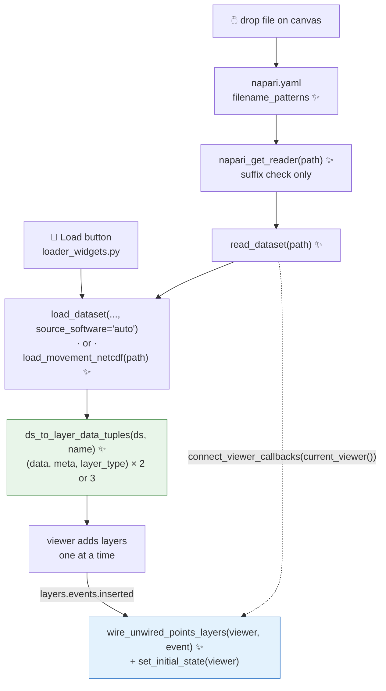

# Proposal for Drag-and-drop loading of tracked data in the movement napari plugin

## Description

**What is this PR?**

This PR is a detailed plan on how to implement the drag-and-drop functionality in our napari widget ([#960](https://github.com/neuroinformatics-unit/movement/issues/960)).

The plan has been generated discussing with Claude Code but is meant to be read by humans. The idea is to present the suggested implementation in detail, so that we can discuss it with @neuroinformatics-unit/movement-active-devs before we implement it.


## Key aspects of suggested implementation

### napari Reader Contribution
We will need to implement a napari [Contribution](https://napari.org/stable/plugins/technical_references/contributions.html) of type `reader`.

A Contribution allows us to extend napari functionality. The `reader` type allows us to extend the file reading functionalities specifically. Contributions are defined in the plugin manifest (the `movement/napari/napari.yaml` file; see reference [here](https://napari.org/stable/plugins/technical_references/contributions.html#readercontribution)).

Our plugin manifest currently only declares the meta widget. Adding a reader would mean adding:
* a `commands` entry pointing at the hook function, and
* a `readers` entry with the filename patterns that trigger it.

```yaml
name: movement
display_name: movement
contributions:
  commands:
    - id: movement.make_widget
      python_name: movement.napari.meta_widget:MovementMetaWidget
      title: movement
    # ------ new command for the reader hook ------------
    - id: movement.get_reader
      python_name: movement.napari.reader:napari_get_reader # new movement.napari.reader.py
      title: Open tracked data with movement
   # ----------------------------------------------------
  widgets:
    - command: movement.make_widget
      display_name: movement
  # --------- new reader contribution --------------
  readers:
    - command: movement.get_reader
      filename_patterns: ["*.h5", "*.csv", "*.slp", "*.nwb", "*.nc"]
      accepts_directories: false
   # ----------------------------------------------------
```

For the filenames that survive the pattern test defined in the reader section, napari will call the function returned by the `command` entry (in the example above, a function called **`napari_get_reader()`**).

`napari_get_reader()` returns a callable: a **reader function** for the given input path. The reader is meant to be cheap: the napari docs describe it as lightweight validation without loading the full file content (e.g. peeking at a header rather than loading fully). `napari_get_reader()` should return a reader function or `None` to decline (and then napari moves on to reader Contributions from other plugins).

```python
def napari_get_reader(path: str | list[str]) -> Callable | None:
    """Return `read_dataset` below, or None to decline."""
```

The reader function returned by napari_get_reader() should take the path(s) and return a list of LayerData tuples (data, attributes, layer_type):.

```python
def read_dataset(path: str | list[str]) -> list[tuple[Any, dict, str]]:
    """Return one (data, attributes, layer_type) tuple per layer."""
```

where `layer_type` is `'points'`, `'tracks'`, `'shapes'`, etc. (defaults to `'image'` if omitted).

On conflicts (i.e. when the filename patterns from several plugin readers match a single file), napari presents a reader-choice dialog with a "remember this choice" option that gets written to user settings.

Remember that the mapping suffix to software isn't 1:1 (e.g. there are multiple source software that produce `.csv` files, see [the guide](https://movement.neuroinformatics.dev/latest/user_guide/input_output.html#supported-third-party-formats)). We can only restrict what passes to `napari_get_reader()` by file suffix.

napari docs provide a [Readers Contribution guide](https://napari.org/stable/plugins/building_a_plugin/guides.html#readers-contribution-guide).

### Layer wiring

A reader contribution defined in `napari.yaml` is registered by the napari plugin engine, [npe2](https://github.com/napari/npe2), at install time. This means it runs whether or not any `movement` widget has ever been instantiated.

The reader path returns `(data, attributes, layer_type)` tuples that napari turns into layers directly. This is different from the path of creation of `movement` napari layers through the form widget: in that case, they go through `DataLoader._add_points_layer` / `_add_tracks_layer`, which also do additional wirings to the layers after they are created.

In `_add_points_layer`, these are the wirings that take place:

* `self.points_layer.events.data.connect(on_points_data_changed)`: subscribes to the layer's event emitter so that dragging/deleting a point re-syncs the companion Tracks layer.
* `self.points_layer.editable = frame_axis_is_sliced(self.viewer)`: `editable` is not a Points.__init__ kwarg, so it can only be assigned on the instance. It also needs the viewer, which the reader path doesn't have at tuple-build time.
* `set_point_symbol_by_edited(self.points_layer)`: mutates `layer.symbol` per point. However, this one is expressible in the tuple (`symbol` is an __init__ kwarg), so it can be pre-computed into the tuple's attributes instead of being applied post-creation as they are today

In `_add_tracks_layer`:

* `self.points_layer.metadata[TRACKS_LAYER_KEY] = self.tracks_layer`: stores the Tracks layer object on the Points layer's metadata.


> [!NOTE]
> **The following assumes that the codebase is as defined in `fix/layer-wiring-lifetime`.**
> That branch moves every layer sync callback out of `DataLoader` and into
> module-level functions in
> [movement/napari/layer_wiring.py](movement/napari/layer_wiring.py), together
> with the metadata keys ([:32-35](movement/napari/layer_wiring.py#L32-L35)).
> The viewer-level connections are made by `connect_viewer_callbacks(viewer)`
> ([:44](movement/napari/layer_wiring.py#L44)).


There are also viewer-level connections that are defined in `connect_viewer_callbacks` and called when the loader widget is instantiated. All wirings are are defined in `movement/napari/layer_wiring.py`, and would need to be manually wired during drag-and-drop.

For a more detailed description, see the collapsed table below.


<details>
<summary>Table: per callback details </summary>

| function (`layer_wiring.py`) | needs manual wiring on drop? |
|---|---|
| `on_points_data_changed` | **Yes** to`layer.events.data.connect(...)`, but it is now a plain function, so the connect is a one-liner with no widget involved. |
| `sync_tracks_layer` | **Yes, indirectly** — no connection of its own, but it reads `points_layer.metadata[TRACKS_LAYER_KEY]` ([:208](movement/napari/layer_wiring.py#L208)), which holds a *layer object* and so can't be put in a `LayerDataTuple`. Must be resolved after both layers exist. |
| `remove_from_tracks_layer` | **Yes, indirectly** — same `TRACKS_LAYER_KEY` reference ([:232](movement/napari/layer_wiring.py#L232)). Resolved by the same step. |
| `set_tracks_layer_data` | No — a pure helper called by the two functions above; nothing to wire. |
| `set_point_symbol_by_edited` | No — `symbol` *is* a `Points.__init__` kwarg, so the edited-point symbols can be pre-computed into the tuple's `attributes` instead of being applied post-creation as they are today ([loader_widgets.py:368](movement/napari/loader_widgets.py#L368)). |
| `frame_axis_is_sliced` | No — a pure query, now taking `viewer` explicitly ([:123](movement/napari/layer_wiring.py#L123)). But its *result* has to be applied once as `layer.editable` at insert time ([loader_widgets.py:364](movement/napari/loader_widgets.py#L364)), and `editable` is **not** a `Points.__init__` kwarg, so that one assignment is manual. |
| `update_points_layers_editable` | No — connected to `viewer.dims.events.order`/`ndisplay` inside `connect_viewer_callbacks` ([:66-67](movement/napari/layer_wiring.py#L66-L67)) and it re-scans *all* layers carrying `POINTS_LAYER_KEY`. Free for dropped layers, provided the reader sets `metadata[POINTS_LAYER_KEY] = True` — but it only fires on a dims change, hence the one-off `editable` assignment in the row above. |
| `update_frame_slider_range` | No — connected to `viewer.layers.events.inserted`/`removed` inside `connect_viewer_callbacks` ([:57-60](movement/napari/layer_wiring.py#L57-L60)), so it fires on the drop itself. |
| `connect_viewer_callbacks` | **Yes, but trivial** — the reader calls `connect_viewer_callbacks(napari.current_viewer())` before returning. Idempotent, so a drop with the widget already open is a no-op, and a drop without it wires the viewer anyway. |

</details>


#### How will the wiring be implemented?

The reader function would call need to call `connect_viewer_callbacks` to set up the viewer connections. We do this in three steps.

**Step 1:** In `layer_wirings.py`, we can collect the per-layer connections in a new `wire_unwired_points_layers` function.

```python
# layer_wiring.py
def wire_unwired_points_layers(viewer, event=None):
    """Wire up any movement Points layers that aren't wired up yet."""
    FOR EACH Points layer IN viewer.layers:      # <---- full rescan, not triggered by event.value
        IF NOT metadata[POINTS_LAYER_KEY]:
            skip  # not a "movement" layer
        IF metadata HAS TRACKS_LAYER_KEY:
            skip   # already wired

        metadata[TRACKS_LAYER_KEY] = viewer.layers[metadata[TRACKS_LAYER_NAME_KEY]]
        layer.events.data.connect(on_points_data_changed)
        layer.editable = frame_axis_is_sliced(viewer)
        set_point_symbol_by_edited(layer)
```

The full rescan of the layers matters: napari inserts the layers defined by a reader one at a time, so when
the Points layer's `inserted` fires, the Tracks layer does not exist yet. The
Points insert event wires what it can, and the subsequent Tracks insert event re-scans and resolves
`TRACKS_LAYER_KEY`.

**Step 2:** The `wire_unwired_points_layers` function would then be called from `connect_viewer_callbacks`, and connected to `viewer.layers.events.inserted`.
```diff
 # layer_wiring.py
 def connect_viewer_callbacks(viewer) -> None:
     """Wire the layer callbacks to a viewer, skipping if already wired.

     These wirings last as long as the viewer, no matter which widget requested
     them.
+
+    Includes the insert handler that wires the per-layer callbacks onto
+    movement Points layers as they appear in the viewer.
     """
     for action in ("inserted", "removed"):
         getattr(viewer.layers.events, action).connect(
             partial(update_frame_slider_range, viewer)
         )
+    viewer.layers.events.inserted.connect(
+        partial(wire_unwired_points_layers, viewer)
+    )
```

> [!NOTE]
> **Handler** is the function attached to an event trigger. E.g. `.connect(f)` registers
> `f` on an emitter, and napari then calls `f(event)` every time that event
> fires, passing an event object describing what happened (for
> `viewer.layers.events.inserted`, it passes `event.index` and `event.value`).
> So "the insert handler" in the docstring is `wire_unwired_points_layers` in its
> role as the function that triggers when the `inserted` event fires.

The name `connect_viewer_callbacks` still fits after this addition: every
connection it makes is to a *viewer-level* emitter (`viewer.layers.events`,
`viewer.dims.events`), made once per viewer and outliving any widget.

**Step 3:** The reader function (returned by `napari_get_reader`) would then call `connect_viewer_callbacks`, so the connection is in place whether or not the widget was ever opened.
```diff
 # reader.py
 def read_dataset(path):
     ds = load_dataset(path, ...)
+    viewer = napari.current_viewer()
+    if viewer is not None:                    # None if no active Qt window
+        connect_viewer_callbacks(viewer)
     return ds_to_layer_data_tuples(ds, Path(path).name)
```

`napari.current_viewer()` returns `None` whenever there is no active Qt main
window ([viewer.py:300-307](https://github.com/napari/napari/blob/v0.6.6/napari/viewer.py#L300-L307)
→ [qt_main_window.py:275-277](https://github.com/napari/napari/blob/v0.6.6/napari/_qt/qt_main_window.py#L275-L277)),
hence the guard. Without it the reader would raise `AttributeError`, which
napari surfaces to the user as a `ReaderPluginError` — and the "reader as a pure
function" tests below, which call `read_dataset` with no viewer at all, would
fail.


### Set initial state
There is an additional function worth running manually too for parity with the Load button: `_set_initial_state`, which puts the frame slider at frame 0 and sets the Points layer as active.

This function was not moved to `layer_wiring.py` as part of the work in `fix/layer-wiring-lifetime`. However, `_set_initial_state` only touches `viewer.dims` and `viewer.layers.selection`, so it can move to `layer_wiring.py` as `set_initial_state(viewer)`, with two additions to the original:

```python
# layer_wiring.py
def set_initial_state(viewer):
    """Set slider at first frame and last movement Points layer as active."""
    # get movement Points layers in viewer
    points_layers = [
        ly for ly in viewer.layers
        if isinstance(ly, Points) and ly.metadata.get(POINTS_LAYER_KEY)
    ]
    IF no points_layers:
        return   # guard: skip if no movement point layers in the viewer
    viewer.dims.current_step = (0,) + viewer.dims.current_step[2:]
    viewer.layers.selection.active = points_layers[-1]
```

The two additions are:
* the `POINTS_LAYER_KEY` filter (the original selects the last `Points` layer of any origin, the additions selects the last movement-type Points layer), and
* the empty-list guard, which is now *required*: as an insert handler this can fire in a viewer that holds no movement layers at all, where the original's `[...][-1]` would raise `IndexError`.


Now the loader widget can call it as:
```diff
 # loader_widgets.py
-        self._set_initial_state()
+        set_initial_state(self.viewer)
```

And `wire_unwired_points_layers` in `layer_wiring.py` can call it as:

```diff
 # layer_wiring.py
 def wire_unwired_points_layers(viewer, event=None):
     ...
+   # if the layer just inserted is of "movement" type,
+   # set initial state of the viewer
+   IF event is None OR event.value.metadata HAS MOVEMENT_LAYER_KEY:
+       set_initial_state(viewer)
```

`event.value` is the layer napari just inserted (napari's `EventedList.inserted`
emits `index` and `value`). The `event is None` branch is only there so the
function stays callable as a plain function in tests without tripping over
`event.value` — as the module's other handlers already are, e.g.
`update_frame_slider_range(loader.viewer)` at
[test_data_loader_widget.py:815](tests/test_unit/test_napari_plugin/test_data_loader_widget.py#L815).

Note that the diff above implies all movement layers have a "movement" key (right
now, only the Points layer is identifiable as ours). If not, the Points layer
would be de-selected by the subsequent Tracks insert (and, for bboxes, the subsequent
Shapes insert), since napari makes each newly inserted layer the active one.
Only the layer selection behaviour is at stake here — the slider stays at frame 0 either way.

**Where do we add the "movement" keys?** In one place: the three `metadata` dicts that
`ds_to_layer_data_tuples` assembles (see Step 1 below). After that refactor, both
the reader path *and* the Load button path build their layers from those tuples, so
`_add_points_layer` / `_add_tracks_layer` / `_add_boxes_layer` stop writing
metadata of their own and there is nothing to keep in sync.

### Which files are drag-and-droppable?

We rely on `load_dataset` for the drag-and-drop, so what is droppable is what the loader registry supports, which is not the same as what the widget's combo box offers:

|                             | `load_dataset` | combobox |
|---|---|---|
| DLC, LP, SLEAP, VIA-tracks  | ✅ | ✅ |
| Anipose, NWB                | ✅ | ❌ |
| movement `.nc`              | ❌ (until [#959](https://github.com/neuroinformatics-unit/movement/issues/959)) | ✅ |

So Anipose and NWB files will be droppable, but not selectable through the form widget yet. ROI `.geojson`/`.json` files are not pose track file so their drops are out of scope.


## Detailed implementation

With the proposed approach, both paths — the Load button and a canvas drop — converge on one pure function
(`ds_to_layer_data_tuples`), and both get apply their wirings from one insert
handler (`wire_unwired_points_layers`).

The symbol ✨ represents "new in this PR".



### The seven changes

<table>
<thead>
<tr><th>#</th><th>Change</th><th>Signature / diff</th></tr>
</thead>
<tbody>

<tr>
<td>1</td>
<td>

**Extract layer construction** into a viewer-free function, so the reader and the Load button build layers identically

</td>
<td>

```python
# new movement/napari/layers.py
# or could also fold into movement/napari/convert.py
def ds_to_layer_data_tuples(
    ds, name_suffix
) -> list[tuple[Any, dict, str]]: ...
```

</td>
</tr>

<tr>
<td>2</td>
<td>

**Extract the netCDF path** — the body of `DataLoader._load_netcdf_file`, raising instead of `show_error`. Deleted once [#959](https://github.com/neuroinformatics-unit/movement/issues/959) is merged.

</td>
<td>

```python
# movement/napari/layers.py
def load_movement_netcdf(path) -> xr.Dataset: ...
```

</td>
</tr>

<tr>
<td>3</td>
<td>

**Add the reader contribution** — suffix matching in the hook; loading, inference and error reporting in the reader function it returns

</td>
<td>

```python
# new movement/napari/reader.py
def napari_get_reader(path) -> ReaderFunction | None:
    if any suffix unsupported:      # mixed multi-file drop
        return None
    return read_dataset             # the reader function


def read_dataset(paths) -> list[tuple[Any, dict, str]]:
    ds = load_dataset(path, source_software="auto")
    # branch for netcdf would use load_movement_netcdf
    if (viewer := napari.current_viewer()) is not None:
        connect_viewer_callbacks(viewer)
    return ds_to_layer_data_tuples(ds, Path(path).name)
```

plus `commands` + `readers` in `napari.yaml`

</td>
</tr>

<tr>
<td>4</td>
<td>

**Wire up the layers the reader created** — a full rescan on every insert, also applying `set_initial_state`

</td>
<td>

```diff
 # In layer_wiring.py
+def wire_unwired_points_layers(viewer, event=None):
+    ...                      # per-layer wiring, then:
+    IF event is None OR event.value.metadata HAS MOVEMENT_LAYER_KEY:
+        set_initial_state(viewer)

 def connect_viewer_callbacks(viewer):
+    viewer.layers.events.inserted.connect(
+        partial(wire_unwired_points_layers, viewer)
+    )
```

</td>
</tr>

<tr>
<td>5</td>
<td>

**Leave the widget's suffix dicts alone** — they duplicate `get_supported_source_software()`, but open PR [#896](https://github.com/neuroinformatics-unit/movement/pull/896) is already dealing with that

</td>
<td><i>(no code)</i></td>
</tr>

<tr>
<td>6</td>
<td>

**Tests** — see § *Overview of tests to write*. Tests include an integration one that refers to parity: a dropped file must produce the same layers as the Load button

</td>
<td><i>(see below)</i></td>
</tr>

<tr>
<td>7</td>
<td>

**Docs** — drag-and-drop in `docs/source/user_guide/gui.md`; see § *Files changed*

</td>
<td><i>(see below)</i></td>
</tr>

</tbody>
</table>

### Steps in detail

Each step below expands to the full argument.

<details>
<summary><b>Step 1 — Extract layer construction into a reusable, viewer-free function</b></summary>

**New file: `movement/napari/layers.py`** (could also fold into `convert.py`).

```python
def ds_to_layer_data_tuples(
    ds: xr.Dataset, name_suffix: str
) -> list[tuple[Any, dict, str]]:
    """Build napari (data, meta, layer_type) tuples from a movement dataset."""
    # ds_to_napari_layers → data_not_nan mask → position_is_nan property
    # → color/text properties → <Style>.as_kwargs() + metadata dict
    return [
        (points_data, points_meta, "points"),
        (tracks_data, tracks_meta, "tracks"),
        # + (boxes_data, boxes_meta, "shapes") for bboxes datasets
    ]
```

**Absorbed near-verbatim from `DataLoader`** (viewer-free parts only):

| from | what |
|---|---|
| `_format_data_for_layers` ([:238-262](movement/napari/loader_widgets.py#L238-L262)) | `ds_to_napari_layers`, `data_not_nan` mask, `position_is_nan` property |
| `_set_common_color_property` ([:315](movement/napari/loader_widgets.py#L315)), `_set_text_property` ([:334](movement/napari/loader_widgets.py#L334)) | properties dicts |
| `_add_points_layer` ([:356](movement/napari/loader_widgets.py#L356)), `_add_tracks_layer` ([:537](movement/napari/loader_widgets.py#L537)), `_add_boxes_layer` ([:562](movement/napari/loader_widgets.py#L562)) | the `PointsStyle`/`TracksStyle`/`BoxesStyle` `.as_kwargs()` calls and the `metadata` dicts — unchanged except `MOVEMENT_LAYER_KEY: True` added to all three (Step 4) |

**Two changes make the metadata expressible before the layers exist:**

| # | today | in the tuple |
|---|---|---|
| 1 | `TRACKS_LAYER_KEY` holds a *layer object*, set in `_add_tracks_layer` ([:559](movement/napari/loader_widgets.py#L559)) | new `TRACKS_LAYER_NAME_KEY = "movement_tracks_layer_name"`, set to `f"tracks: {name_suffix}"`; Step 4 resolves it to the object under the existing `TRACKS_LAYER_KEY`, so `_sync_tracks_layer` / `_remove_from_tracks_layer` are untouched |
| 2 | `editable` — **not** a `Points.__init__` kwarg (verified against pinned napari 0.6.6). Same for `_set_point_symbol_by_edited` ([:426](movement/napari/loader_widgets.py#L426)) | stays a post-creation assignment, done in Step 4 |

**Load button then goes through the same tuples** (dataset branching unchanged):

```diff
 # loader_widgets.py — DataLoader._on_load_clicked
-        self._add_points_layer()
-        self._add_tracks_layer()
+        for tup in ds_to_layer_data_tuples(ds, file_name):
+            self.viewer.add_layer(Layer.create(*tup))   # public napari API
```

</details>

<details>
<summary><b>Step 2 — Extract the netCDF loading path so the reader can use it</b></summary>

`load_dataset` has no registered `.nc` loader (that is [#959](https://github.com/neuroinformatics-unit/movement/issues/959)), so the reader needs
a netCDF branch. The widget already has one — move the body of
`DataLoader._load_netcdf_file` ([:252-293](movement/napari/loader_widgets.py#L252-L293))
to `movement/napari/layers.py`:

```python
def load_movement_netcdf(path) -> xr.Dataset:
    """Open a movement netCDF file, raising ValueError if unusable."""
    # xr.open_dataset → rename_legacy_dimensions
    # → ds_type must be "poses" or "bboxes"
    # → ValidPosesInputs.validate / ValidBboxesInputs.validate
```

Logic unchanged; the one difference is who reports the error:

```diff
-        show_error(msg)
-        return None
+        raise ValueError(msg)
```

- **Widget** wraps it and calls `show_error` with the same messages → user-facing
  behaviour and `test_data_loader_widget.py`'s netCDF error cases untouched.
- **Reader** reports through its own error path (Step 3).
- **After [#959](https://github.com/neuroinformatics-unit/movement/issues/959)** this whole helper is deleted and the reader's `.nc` branch
  collapses to `load_dataset(path)`.
- **Third-party datasets are deliberately not re-validated** — they come out of
  `load_dataset` already built through `ValidPosesInputs`/`ValidBboxesInputs`
  (where `ds_type` is set, [datasets.py:470](movement/validators/datasets.py#L470)),
  so a re-check is a no-op. Whether the GUI's stricter rules should be enforced
  at the conversion layer for *every* dataset is a [#959](https://github.com/neuroinformatics-unit/movement/issues/959) question → discussion
  point 1.

</details>

<details>
<summary><b>Step 3 — The reader contribution</b></summary>

**New file: `movement/napari/reader.py`**

```python
SUPPORTED_SUFFIXES = set().union(*get_supported_source_software().values()) | {
    ".nc"
}


def napari_get_reader(path: str | list[str]) -> ReaderFunction | None:
    """Return a reader for movement-supported files, else None."""
    paths = [path] if isinstance(path, str) else path
    if any(Path(p).suffix not in SUPPORTED_SUFFIXES for p in paths):
        return None  # mixed multi-file drop only
    return read_dataset


def read_dataset(path) -> list[tuple[Any, dict, str]]:
    layer_data = []
    for p in [path] if isinstance(path, str) else path:
        try:
            ds = (
                load_movement_netcdf(p)
                if Path(p).suffix == ".nc"  # Step 2
                else load_dataset(p, source_software="auto", fps=None)
            )
        except (ValueError, OSError) as e:
            show_error(
                f"{Path(p).name}: {e}  — use the movement widget to "
                "select the source software explicitly."
            )
            continue  # skip this file, keep the others
        layer_data += ds_to_layer_data_tuples(ds, Path(p).name)  # Step 1
    if (viewer := napari.current_viewer()) is not None:  # Step 4
        connect_viewer_callbacks(viewer)
    return layer_data or [(None,)]  # napari's "no layers" sentinel
```

- **Suffix matching only in the hook.** No content validation: it runs for every
  candidate drop and `ValidVIATracksCSV` does a full `pd.read_csv`. Inference
  happens in the reader function.
- **`None` is not a graceful "can't read this".** For npe2 plugins the
  reader-choice dialog is built from `filename_patterns` alone
  (`get_potential_readers` → `pm.iter_compatible_readers`), *before* the hook
  runs — so declining neither hides us from the dialog nor hands off to another
  plugin. If the user picked movement they get a `ReaderPluginError` ("was
  selected to open …, but returned no data") instead of our message. Hence
  everything unloadable is handled *inside* `read_dataset`, via `show_error` +
  the `[(None,)]` sentinel.
- **Multi-file drops** concatenate, so one set of layers per file.
- **`current_viewer()` is guarded**, since it is `None` when there is no active
  Qt main window (see § *Layer wiring*, Step 3). A canvas drop always has one; a
  headless call — including the pure-function reader tests — does not.

**Manifest** — [movement/napari/napari.yaml](movement/napari/napari.yaml) gains:

```yaml
  commands:
    - id: movement.get_reader
      python_name: movement.napari.reader:napari_get_reader
      title: Open tracked data with movement
  readers:
    - command: movement.get_reader
      filename_patterns: ["*.h5", "*.csv", "*.slp", "*.nwb", "*.nc"]
      accepts_directories: false
```

- npe2 manifests are static → patterns hard-coded → add a test asserting they
  equal `get_supported_source_software()` ∪ `{".nc"}`, so the two can't silently
  diverge (also the tripwire when a new loader is registered).
- No packaging change: `MANIFEST.in` ships `napari.yaml`, entry point already
  exists ([pyproject.toml:52](pyproject.toml#L52)).

</details>

<details>
<summary><b>Step 4 — Wire up layers created by the reader</b></summary>

**Why.** A reader hands napari *static* `(data, attributes, layer_type)` — it
cannot attach behaviour. But `DataLoader` wires three live things onto a Points
layer after creation, none of which survive a `LayerDataTuple`:

| wiring | today | what it does |
|---|---|---|
| `events.data.connect(on_points_data_changed)` | [loader_widgets.py:363](movement/napari/loader_widgets.py#L363) | keeps the Tracks layer in sync when a point is dragged or deleted |
| `editable = frame_axis_is_sliced(viewer)` | [loader_widgets.py:364](movement/napari/loader_widgets.py#L364) | blocks editing when frame isn't the slider axis, so a drag can't move a point to another frame |
| `metadata[TRACKS_LAYER_KEY] = self.tracks_layer` | [loader_widgets.py:394](movement/napari/loader_widgets.py#L394) | the Points→Tracks object reference `sync_tracks_layer` needs |

Skipping this is not cosmetic: drag a point on a dropped layer → Points moves,
Tracks doesn't → they silently diverge → `DataSaver` writes that state to `.nc`.
Shipping dropped layers read-only doesn't dodge it either: `editable` is not a
`Points.__init__` kwarg (Step 1). **Some post-creation step is unavoidable.**

**The function** — `wire_unwired_points_layers`, written out in § *Layer wiring*
above. It lives in `layer_wiring.py`, not on the widget: it changes layer state
that must outlive the dock, which is that module's stated rule.

**When it runs.** One connection inside `connect_viewer_callbacks`
([:57-60](movement/napari/layer_wiring.py#L57-L60)) covers both entry paths:

```
widget opened first  ──> DataLoader.__init__ → connect_viewer_callbacks ──┐
                                                                          ├─> inserted → handler
drop, widget never opened ──> read_dataset → connect_viewer_callbacks ────┘
```

- `_WIRED_VIEWERS` guard makes the double call harmless — pinned by
  `test_connect_viewer_callbacks_is_idempotent`
  ([test_layer_wiring.py:94](tests/test_unit/test_napari_plugin/test_layer_wiring.py#L94)).
- The "once at the end of `__init__`" pass on `main` is no longer needed: it
  existed to catch layers dropped before the widget was opened, and the reader
  now wires the viewer itself.

**The ordering trap.** napari adds a reader's layers **one at a time**
(`_add_layers_with_plugins` → `_add_layer_from_data` per tuple), so `inserted`
fires per layer:

```
insert "points: file.h5"  ──> handler: connect events.data ✅
                                       set editable        ✅
                                       resolve TRACKS_LAYER_KEY ❌  (tracks doesn't exist yet)
insert "tracks: file.h5"  ──> handler rescans all layers:
                                       resolve TRACKS_LAYER_KEY ✅
```

"Not added yet" is the **common** case, and it fails *quietly*. So the handler
must be **idempotent and rescan `viewer.layers` in full on every insert**, never
just `event.value`; the "no `TRACKS_LAYER_KEY` yet" check keeps repeated scans
cheap.

| alternative | why worse |
|---|---|
| return the tracks tuple first | depends on napari preserving order and nobody reordering the list later |
| defer via a single-shot timer | adds async behaviour that is awkward to test |

**Also applies `set_initial_state`** (§ *Set initial state* above), so a drop
gets the Load button's "slider to frame 0, Points layer active" — this is what
needs the new `MOVEMENT_LAYER_KEY`.

No known limitation left: dropped layers are fully wired whether or not the
widget is ever opened, and stay wired after it is closed → discussion point 2.

</details>

<details>
<summary><b>Step 5 — Deliberately <i>not</i> touching the widget's suffix dicts</b></summary>

`SUPPORTED_POSES_FILES` / `SUPPORTED_BBOXES_FILES`
([:37-56](movement/napari/loader_widgets.py#L37-L56)) duplicate
`get_supported_source_software()` and already drift from it (Anipose and NWB are
registered in the backend but missing from the combo box).

- **Open PR [#896](https://github.com/neuroinformatics-unit/movement/pull/896) fixes exactly this** — adds Anipose and NWB to the dropdown and
  changes the form's `rowCount()`. Deriving these dicts from the registry here
  would collide.
- **This PR:** leave them alone. Note in the PR description that once [#896](https://github.com/neuroinformatics-unit/movement/pull/896)
  merges, replacing them with a `get_supported_source_software()`-derived mapping
  (plus the manual netCDF entry) is a small, safe follow-up.
- **Rebase check:** [#896](https://github.com/neuroinformatics-unit/movement/pull/896) rewrites `_on_source_software_changed` and the form
  layout — adjacent to, but not overlapping, Steps 1 and 4.

</details>


## Files changed

| File | Change |
|---|---|
| `movement/napari/layers.py` | **new** — `ds_to_layer_data_tuples`, `load_movement_netcdf`. They could also fold into `movement/napari/convert.py` |
| `movement/napari/reader.py` | **new** — `napari_get_reader` |
| `movement/napari/napari.yaml` | add `movement.get_reader` command + `readers` contribution |
| `movement/napari/layer_wiring.py` | add `wire_unwired_points_layers` (connected in `connect_viewer_callbacks`) , `TRACKS_LAYER_NAME_KEY` and `MOVEMENT_LAYER_KEY`; absorb `set_initial_state` |
| `movement/napari/loader_widgets.py` | delegate to the new module; `_load_netcdf_file` becomes a thin `show_error` wrapper |
| `docs/source/user_guide/gui.md` | document drag-and-drop of tracked data (§ *Load the tracked dataset*, ~line 122): the reader-choice dialog, the fps-in-frames caveat, and "use the widget for loader kwargs" |
| `docs/source/api_index.rst` | add `movement.napari.reader` / `layers` to the API docs |
| `tests/test_unit/test_napari_plugin/test_reader.py` | **new** |
| `tests/test_unit/test_napari_plugin/test_layer_wiring.py` | add `wire_unwired_points_layers` tests, alongside the existing widget-lifetime ones |
| `tests/test_unit/test_napari_plugin/test_data_loader_widget.py` | adapt to the refactor |


## Overview of tests to write

1. **Unit tests with reader as a pure function** (no viewer needed, a first for this test
   package). Test should verify that:

   * `napari_get_reader` returns a callable for `dlc_h5_file`,
   `dlc_csv_file`, `lp_csv_file`, `sleap_slp_file`, `sleap_analysis_file`,
   `anipose_csv_file`, `via_tracks_csv`, `valid_netcdf_file`
   ([tests/fixtures/files.py](tests/fixtures/files.py)).
   * `napari_get_reader` returns `None` for
   `wrong_extension_file`, `directory`, `nonexistent_file`.
   * Reader function returns 2 tuples for poses, 3 for bboxes, with layer types
   `("points","tracks"[,"shapes"])` and `meta["metadata"][POINTS_LAYER_KEY] is True`.
   * If bad content is passed (`readable_csv_file`, `invalid_dstype_netcdf_file`,
   `unopenable_netcdf_file`, `invalid_netcdf_file_missing_confidence`) →
   `show_error` is called and `[(None,)]` is returned.
   * Plugin manifest patterns equal `get_supported_source_software()` ∪ `{".nc"}` and `npe2.PluginManifest` validates
   the YAML.

2. **Unit tests checking parity with the widget**: for a sample file, the layer
   data, properties and metadata returned from `ds_to_layer_data_tuples` are identical to what
   the `loaded_data_loader` fixture ([tests/fixtures/napari.py](tests/fixtures/napari.py))
   produces via the Load button. This is the regression guard for the refactor.

3. **Unit tests checking layer wiring**, using the `make_napari_viewer_proxy`
   fixture. Each test opens a file via the reader
   (`viewer.open(path, plugin="movement")`) in one of four scenarios:

   * widget instantiated first, then open;
   * open first, then widget instantiated;
   * **open with the widget never instantiated at all** — the scenario that
   `fix/layer-wiring-lifetime` makes work, and the one that would silently
   regress if the reader forgot its `connect_viewer_callbacks` call;
   * open, then widget instantiated and closed — mirroring
   `test_point_edit_syncs_tracks_layer_after_widget_is_gone`
   ([test_layer_wiring.py:36](tests/test_unit/test_napari_plugin/test_layer_wiring.py#L36)).

   In every scenario, the tests should verify that:

   * `TRACKS_LAYER_KEY` is resolved to the Tracks layer object;
   * the Points layer has `editable is True`;
   * the frame slider range is correct;
   * editing a point (with the existing `move_point`/`remove_point` fixtures)
   keeps the Tracks layer in sync.

4. **Integration test** of the full drag-and-drop round trip: open a file via
   the reader → edit a point → save with `DataSaver` → re-open the saved `.nc`.
   This checks that [save_widget.py](movement/napari/save_widget.py), which
   reads `POINTS_PROPERTIES_KEY` and `DATASET_ATTRS_KEY` off the layers, works
   on reader-created layers too.


## Verifications for agent to run
* **Manual**: `movement launch`; drag a DLC `.h5`, a DLC `.csv` (confirm the
   reader-choice dialog), a `.slp`, a VIA `.csv` and a movement `.nc` — with the
   widget open and closed, and several files at once. Confirm layer names,
   colours, tooltips and slider match the Load-button result.

   Most of these files can be fetched from the sample datasets module, which
   downloads them to a local cache and returns their paths:

   ```python
   from movement import sample_data

   sample_data.list_datasets()  # 37 files currently
   sample_data.fetch_dataset_paths("DLC_single-wasp.predictions.h5")["poses"]
   ```

   The registry covers every format the reader claims except `.nwb` and
   movement `.nc`: DLC (`.h5` and `.csv`), LP (`.csv`), SLEAP (`.slp` and
   `.analysis.h5`), VIA-tracks (`.csv`) and Anipose
   (`anipose_mouse-paw_anipose-paper.triangulation.csv`). For the `.nc` case,
   save a dataset from the widget's `DataSaver` first; the `.nwb` case needs a
   file of our own or the `tests/fixtures/files.py` fixtures.

* `pytest tests/test_unit/test_napari_plugin tests/test_unit/test_io` and
   `pre-commit run --all-files`.


## Points to discuss

1. **Relation to [#959](https://github.com/neuroinformatics-unit/movement/issues/959).** Step 2's `load_movement_netcdf` would be deleted if [#959](https://github.com/neuroinformatics-unit/movement/issues/959) is merged, so the team may prefer to land [#959](https://github.com/neuroinformatics-unit/movement/issues/959) first.

2. **GUI-specific validation**
   In [#959](https://github.com/neuroinformatics-unit/movement/issues/959), @niksirbi suggested that
   `load_dataset` could validate netCDF only *minimally*, with the GUI's stricter
   requirements enforced at the conversion layer instead. This could be a
   `validate_ds_for_napari(ds)` at the top of `ds_to_layer_data_tuples`, giving
   the GUI-compatibility rules a single home that `gui.md` could point at. Not
   needed for drag-and-drop (third-party datasets are valid by construction) and
   a behaviour change, so it is deliberately left out here.

3. **The reader's dependency on `current_viewer()`.** The guard itself is
   settled (Step 3), but the gap underneath is not: a reader plugin gets no
   handle on the viewer its layers are going into, and has to reach for a
   global. A knock-on is that `current_viewer()` gives the *active* window's
   viewer, so with two viewers open the reader could in principle wire the wrong
   one — in practice the drop target is the active window. This is a napari limitation at the moment though.

4. **fps consistency.** Drops use `fps=None` and thus show frame indices, while the
   widget defaults to `1.0`. Should these be made consistent?

5. **VIA tracks validation cost.** `infer_source_software` probes every `.csv`
   validator and `ValidVIATracksCSV` parses the whole file, so dropping a large
   non-VIA `.csv` pays that cost before falling through. A header-only pre-check
   in `ValidVIATracksCSV` would help. Should this be part of this PR?

6. **Ambiguous `.h5`.** A file matching both DLC and SLEAP validators makes
   `infer_source_software` raise (only the DLC/LP pair is whitelisted), so on drop
   we can only error and redirect to the widget. Should napari get a
   disambiguation prompt, or the backend expose the candidate list?

7. **Relation to [#896](https://github.com/neuroinformatics-unit/movement/pull/896).** [#896](https://github.com/neuroinformatics-unit/movement/pull/896) rewrites the same widget's dropdown and form
   layout, so whichever merges second eats a rebase; [#896](https://github.com/neuroinformatics-unit/movement/pull/896) is already open and
   probably goes first. Step 1's extraction is mostly in methods that [#896](https://github.com/neuroinformatics-unit/movement/pull/896) doesn't
   touch, so a concurrent merge is survivable.

8. **`ds.attrs["source_file"]` is inconsistent.** Set by the DLC/LP, SLEAP,
   VIA-tracks and NWB loaders but not by `from_anipose_file`
   ([load_poses.py:677-711](movement/io/load_poses.py#L677-L711)). Additionally,
   a netCDF round trip still points at the original file. Should the backend
   guarantee a `source_file` defined on every loaded dataset? Separate issue if so.


9. **Potential follow-up: autopopulate loader widget form after drag-and-dropping.**

   - It would let a user who dropped a file tweak `fps` (or, post-[#896](https://github.com/neuroinformatics-unit/movement/pull/896), loader
     kwargs) without re-typing the path and source software.

   - It needs no reader→widget coupling: the source software and `ds.attrs`
     already ride on the layer metadata, and `wire_unwired_points_layers` runs for
     every inserted movement layer, so the widget can fill its own fields from a
     wired layer. It can therefore be added later without revisiting the reader.

   - **What would the Load button do?** As things stand, drop → change fps to 30 → **Load**
     adds a *second* set of layers and leaves the user to delete the first.
     Options: (a) accept it this, it matches today's behaviour when you load the
     same file twice; (b) detect that the form still describes an existing
     `movement` layer and offer to replace it in place; (c) add a distinct
     "Reload" affordance that appears once a layer is wired up. I (@sfmig) think (a)
     would be fine for a first version. Claude suggests "(b) is arguably
     what a user expects after the form has been filled in *for* them."

   - Anipose and NWB have no combo entry, and
     `setCurrentText` on a non-editable `QComboBox` silently keeps the previous
     selection. So a dropped Anipose file would show its path next to
     `DeepLabCut` and **Load** would attempt the wrong load. Autopopulation
     would need an explicit "can't configure this one here" state rather than a
     silent no-op. Stops mattering once [#896](https://github.com/neuroinformatics-unit/movement/pull/896) is merged.

## Feedback on the format of this proposal
Any comments on the sections and formatting of this proposal are more than welcome.
